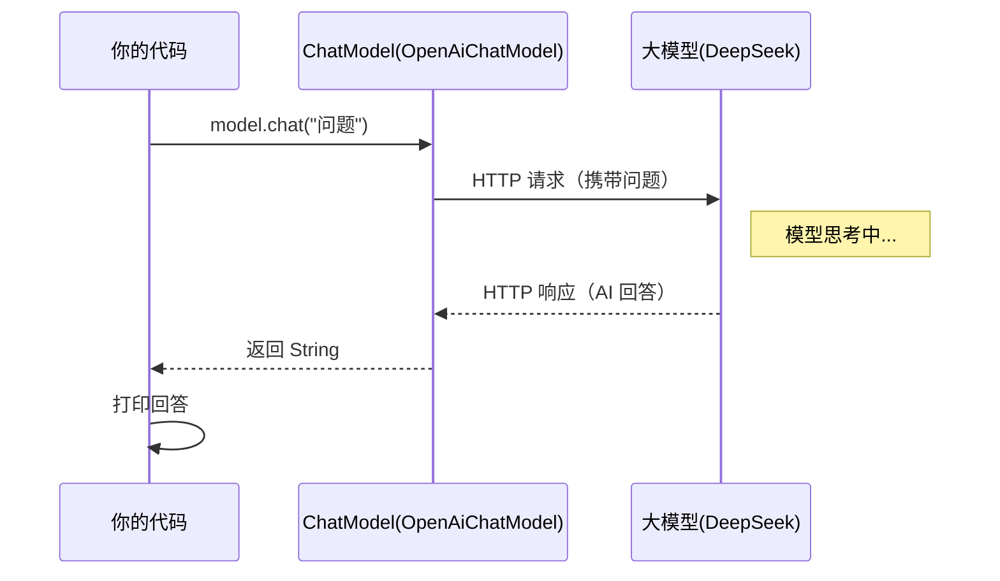

# 01 · 概念与快速上手

> 本模块目标：理解 LangChain4j 最核心的几个概念，并跑通**人生第一个**大模型调用。

## 一、要懂的核心概念（零基础必读）

| 概念 | 大白话解释 |
|---|---|
| **大模型 (LLM)** | 像 DeepSeek、GPT 这样的 AI，给它文字、它回你文字。 |
| **LangChain4j** | 面向 Java 的开源库，用统一 API 封装各家大模型与向量库（对标 Python 的 LangChain）。 |
| **ChatModel** | LangChain4j 对"对话模型"的统一抽象（底层接口），核心方法是 `chat(...)`。 |
| **OpenAiChatModel** | `ChatModel` 的实现，对接 OpenAI 兼容接口；DeepSeek 兼容 OpenAI，所以也用它。 |
| **Builder 构建器** | 用 `XxxModel.builder()...build()` 手动构建模型，参数显式传入，一目了然。 |

> 本项目用 **Spring Boot 当“运行外壳”**（提供启动类 + `CommandLineRunner` + 读取共享配置），
> 而真正的 AI 调用全部用 **LangChain4j 原生 API**。

## 二、调用原理流程图



## 三、关键代码

```java
ChatModel model = OpenAiChatModel.builder()
        .baseUrl(baseUrl)        // 接口地址（DeepSeek 兼容地址，需带 /v1）
        .apiKey(apiKey)          // API 密钥
        .modelName(modelName)    // 模型名（deepseek-chat）
        .build();

String answer = model.chat("请用一句话解释什么是 LangChain4j？");
```

## 四、怎么运行

1. 在 `../config/langchain4j-common.yml` 配好 **DeepSeek 的 Key**（或设环境变量 `DEEPSEEK_API_KEY`）。
2. 在本模块目录执行：

```bash
cd 01-get-started
mvn spring-boot:run
```

> 想零成本试跑？把共享配置里的 chat 改成演示代理：`base-url=http://langchain4j.dev/demo/openai/v1`、`api-key=demo`、`model=gpt-4o-mini`。

## 五、小结

- 引入 `langchain4j-open-ai` + 配一处 Key，就能用 `ChatModel` 调大模型。
- 用 `OpenAiChatModel.builder()` 构建模型，`model.chat(String)` 是最基础的调用。
- 下一站：[02-chat-and-language-models](../02-chat-and-language-models) 学习底层消息与请求/响应对象。
