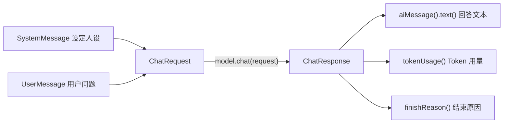

# 02 · 底层 ChatModel API

> 本模块目标：掌握 LangChain4j 的**底层对话 API**——用消息对象和请求/响应对象做精细控制。

## 一、三种消息角色

| 消息类型 | 作用 |
|---|---|
| **SystemMessage** | 系统指令，给 AI 设定角色/风格/约束（优先级最高） |
| **UserMessage** | 用户说的话（你的问题） |
| **AiMessage** | AI 的回答（响应里取出来的就是它） |

## 二、请求/响应对象

| 对象 | 作用 |
|---|---|
| **ChatRequest** | 把"多条消息 + 参数"打包成一次请求 |
| **ChatResponse** | 模型完整响应：`aiMessage()` 回答、`tokenUsage()` Token 用量、`finishReason()` 结束原因 |

## 三、流程图



## 四、关键代码

```java
SystemMessage system = SystemMessage.from("你是一位耐心的 Java 老师...");
UserMessage user = UserMessage.from("什么是变量？");

ChatRequest request = ChatRequest.builder()
        .messages(system, user)
        .build();

ChatResponse response = model.chat(request);
System.out.println(response.aiMessage().text());      // 回答
System.out.println(response.tokenUsage());            // Token 用量
System.out.println(response.finishReason());          // 结束原因
```

## 五、运行

```bash
cd 02-chat-and-language-models
mvn spring-boot:run
```

## 六、小结

- `chat(String)` 是简化形式；`chat(ChatRequest)` 是完整形式，能携带多条消息并取元信息。
- 记住三种消息角色与 `ChatResponse` 的三个常用方法。
- 下一站：[03-response-streaming](../03-response-streaming) 学习流式（打字机）输出。
