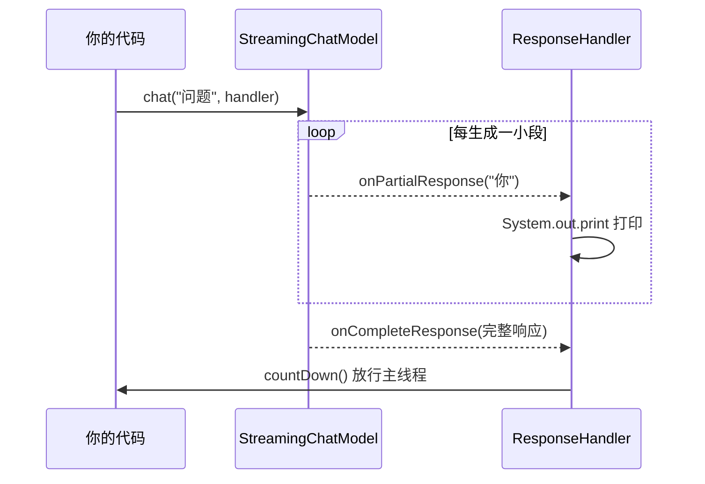

# 03 · 流式输出（Response Streaming）

> 本模块目标：让模型像打字机一样**逐字实时返回**，而不是等全部生成完再一次性返回。

## 一、流式 vs 非流式

| 方式 | 原理 | 适用场景 |
|---|---|---|
| **非流式 `chat()`** | 等模型生成全部，再一次性返回 | 后台任务、需完整结果再处理 |
| **流式 `chat(q, handler)`** | 边生成边回调，逐段到达 | 聊天界面（秒出首字，体验好） |

## 二、关键类型

- **StreamingChatModel**：流式对话模型接口（`OpenAiStreamingChatModel`）。
- **StreamingChatResponseHandler**：回调处理器，关键回调：
  - `onPartialResponse(String)`：收到一小段文本（边到边打印）。
  - `onCompleteResponse(ChatResponse)`：全部完成。
  - `onError(Throwable)`：出错。

## 三、流程图



## 四、关键代码

```java
StreamingChatModel model = OpenAiStreamingChatModel.builder()
        .baseUrl(baseUrl).apiKey(apiKey).modelName(modelName).build();

CountDownLatch latch = new CountDownLatch(1);
model.chat("请分三点说明学习编程的好处。", new StreamingChatResponseHandler() {
    public void onPartialResponse(String partial) { System.out.print(partial); }
    public void onCompleteResponse(ChatResponse resp) { latch.countDown(); }
    public void onError(Throwable e) { latch.countDown(); }
});
latch.await(60, TimeUnit.SECONDS);  // 流式是异步的，主线程要等回调完成
```

> ⚠️ 流式调用是**异步**的：`chat(...)` 立刻返回、后台推送结果。必须用 `CountDownLatch` 等到完成，否则主线程提前退出会截断输出。

## 五、运行

```bash
cd 03-response-streaming
mvn spring-boot:run
```

## 六、小结

- 流式用 `StreamingChatModel` + `StreamingChatResponseHandler`。
- 核心回调：`onPartialResponse` / `onCompleteResponse` / `onError`。
- 下一站：[04-ai-services](../04-ai-services) 学习声明式高级 API。
