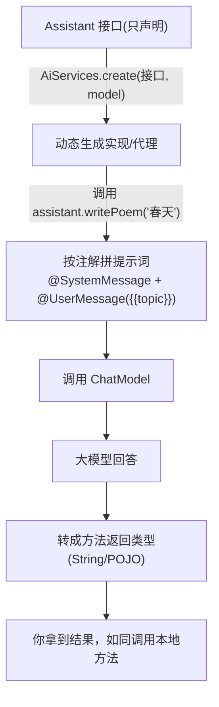

# 04 · AI Services 声明式高级 API

> 本模块目标：掌握 LangChain4j 最强大、最常用的特性 **AI Services**——
> 只声明一个 Java 接口，框架在运行时自动生成实现。

## 一、为什么用 AI Services

| 方式 | 代码量 | 体验 |
|---|---|---|
| 底层 API（模块02） | 自己拼 Message、ChatRequest、解析 ChatResponse | 啰嗦但灵活 |
| **AI Services** | 只写一个接口方法 | 简洁直观，真实项目主流 |

## 二、关键注解

| 注解 | 作用 |
|---|---|
| `@SystemMessage` | 在方法上写死系统指令（AI 人设/规则） |
| `@UserMessage` | 定义用户消息模板，可用 `{{变量}}` 占位 |
| `@V("name")` | 把方法参数绑定到模板里的 `{{name}}` |

## 三、流程图



## 四、关键代码

```java
// 1) 声明接口（不写实现）
interface Assistant {
    String chat(String userMessage);

    @SystemMessage("你是一位才华横溢的中文诗人，只用中文回答。")
    @UserMessage("请以「{{topic}}」为主题，写一首四行的短诗。")
    String writePoem(@V("topic") String topic);
}

// 2) 自动生成实现
Assistant assistant = AiServices.create(Assistant.class, model);

// 3) 像调用本地方法一样使用
String poem = assistant.writePoem("春天");
```

## 五、运行

```bash
cd 04-ai-services
mvn spring-boot:run
```

## 六、小结

- AI Services = 声明接口 + 注解，`AiServices.create(...)` 自动实现。
- 后续的记忆、工具、RAG、结构化输出都能以 AI Services 方式优雅装配。
- 下一站：[05-chat-memory](../05-chat-memory) 让 AI 记住上下文。
