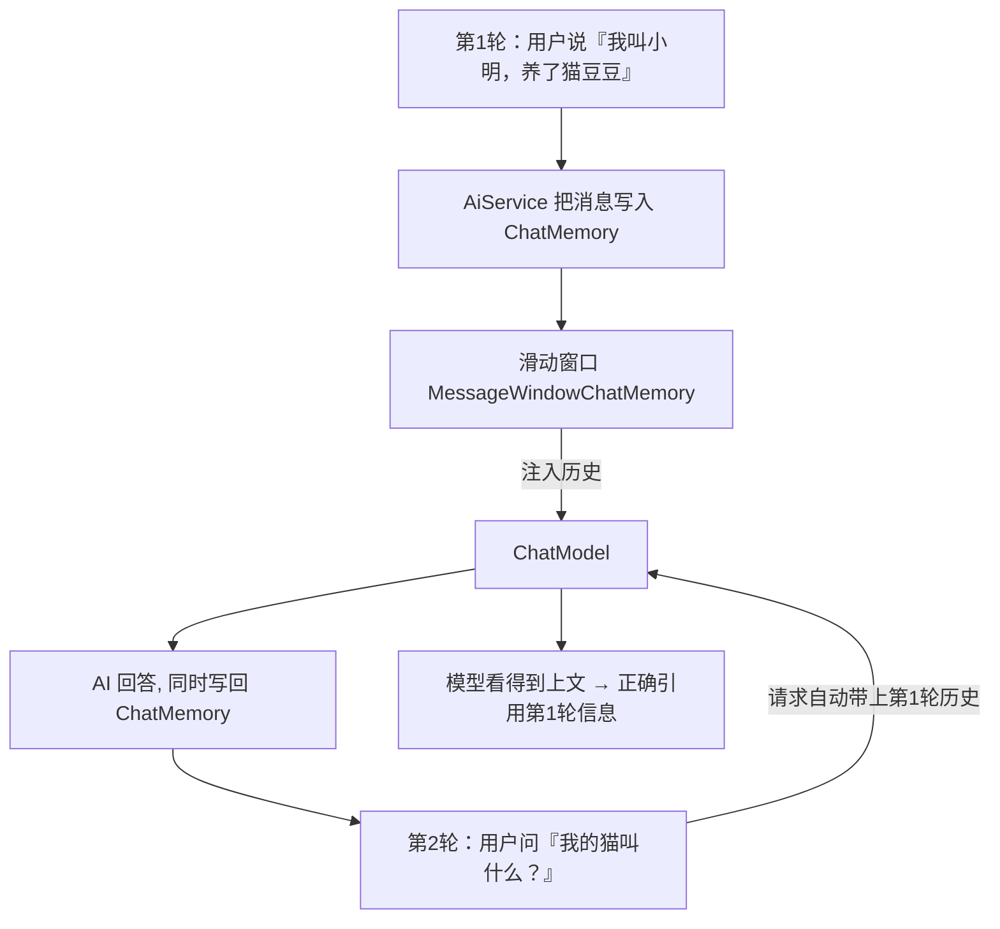

# 05 · Chat Memory 对话记忆

> 本模块目标：让 AI 助手记住上文，实现真正的多轮连续对话；并理解如何用
> `@MemoryId` 为多个用户提供互相隔离的独立记忆。

## 一、为什么需要记忆

大模型 API 本身是**无状态**的——每次请求都从零开始，不记得你上一句说了什么。
要实现“连续对话”，必须由我们把历史消息累积下来，并在下一次请求时一起带给模型。
`ChatMemory` 就是 LangChain4j 帮我们自动做这件事的抽象。

| 概念 | 作用 |
|---|---|
| `ChatMemory` | 对话记忆抽象，自动累积/注入历史消息 |
| `MessageWindowChatMemory.withMaxMessages(n)` | 滑动窗口记忆，仅保留最近 n 条，防 Token 爆炸 |
| `.chatMemory(memory)` | 给 AiService 装上“单一共享记忆” |
| `@MemoryId` | 标记“记忆身份”参数，区分不同用户/会话 |
| `.chatMemoryProvider(id -> ...)` | 按 id 分配各自独立的记忆，互不串台 |

## 二、流程图



## 三、关键代码

```java
// 1) 创建滑动窗口记忆（最多保留 10 条消息）
MessageWindowChatMemory memory = MessageWindowChatMemory.withMaxMessages(10);

// 2) 给 AiService 装上记忆 —— 单一共享记忆
Assistant assistant = AiServices.builder(Assistant.class)
        .chatModel(model)
        .chatMemory(memory)
        .build();

// 连续两轮，第二轮能引用第一轮的信息
assistant.chat("我叫小明，养了一只橘猫豆豆。");
assistant.chat("我的猫叫什么？我叫什么？"); // 答得对 = 记住了上文

// 3) 多用户隔离 —— 按 @MemoryId 分配独立记忆
Assistant multi = AiServices.builder(Assistant.class)
        .chatModel(model)
        .chatMemoryProvider(id -> MessageWindowChatMemory.withMaxMessages(10))
        .build();
multi.chat("userA", "我喜欢篮球"); // 只存进 A 的记忆
multi.chat("userB", "我喜欢游泳"); // 只存进 B 的记忆
```

对应接口：

```java
public interface Assistant {
    String chat(String userMessage);                                   // 单一记忆
    String chat(@MemoryId String memoryId, @UserMessage String text);  // 多用户记忆
}
```

## 四、运行

```bash
cd 05-chat-memory
mvn spring-boot:run
```

## 五、小结

- 大模型无状态，多轮对话靠 `ChatMemory` 累积并注入历史。
- `MessageWindowChatMemory` 用滑动窗口控制历史长度，避免 Token 失控。
- `@MemoryId` + `chatMemoryProvider` 实现多用户/多会话的记忆隔离。
- 下一站：[06-model-parameters](../06-model-parameters) 调节 temperature、maxTokens、topP 等参数控制模型输出。
