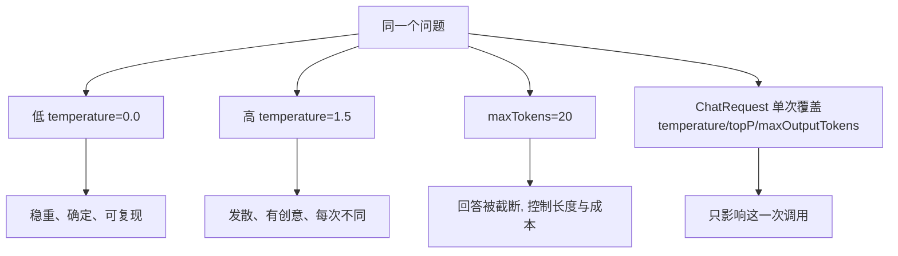

# 06 · Model Parameters 模型参数

> 本模块目标：理解 `temperature` / `maxTokens` / `topP` 等生成参数的含义，
> 学会在“稳定可复现”和“有创意发散”之间按业务需求调参。

## 一、常用参数一览

| 参数 | 取值范围 | 作用 | 调高的效果 |
|---|---|---|---|
| `temperature` | 0 ~ 2 | 控制随机性 | 更随机、更有创意、每次更不同 |
| `maxTokens` | 正整数 | 限制输出最大 Token 数 | 允许更长的回答（也更贵） |
| `topP` | 0 ~ 1 | 核采样，仅从累计概率 topP 的候选词采样 | 候选词更多、更发散 |
| `frequencyPenalty` | -2 ~ 2 | 抑制重复用词 | 更少重复 |
| `presencePenalty` | -2 ~ 2 | 鼓励谈新话题 | 更爱发散到新内容 |
| `seed` | 整数 | 随机种子 | 固定后相同输入更可复现 |

> 经验：`temperature` 和 `topP` 一般**二选一**调；事实问答/信息抽取用低温（0~0.3），写作/头脑风暴用高温（0.8~1.5）。

## 二、两种设置途径

| 途径 | 写法 | 生效范围 |
|---|---|---|
| 模型 builder | `OpenAiChatModel.builder().temperature(0.0)...` | 该模型实例的**所有**请求（全局默认） |
| 单次请求 | `ChatRequest.builder().temperature(1.2).maxOutputTokens(60)...` | 只对**这一次**请求生效 |

## 三、流程图



## 四、关键代码

```java
// 途径A：在 builder 上设，全局生效
ChatModel cold = OpenAiChatModel.builder()
        .baseUrl(baseUrl).apiKey(apiKey).modelName(modelName)
        .temperature(0.0)   // 低温：稳定
        .build();

ChatModel hot = OpenAiChatModel.builder()
        .baseUrl(baseUrl).apiKey(apiKey).modelName(modelName)
        .temperature(1.5)   // 高温：创意
        .maxTokens(20)      // 限制输出长度
        .build();

// 途径B：在 ChatRequest 上按单次请求覆盖
ChatRequest request = ChatRequest.builder()
        .messages(UserMessage.from("给咖啡店起个名"))
        .temperature(1.2)
        .topP(0.9)
        .maxOutputTokens(60)
        .build();
ChatResponse response = model.chat(request);
```

## 五、运行

```bash
cd 06-model-parameters
mvn spring-boot:run
```

## 六、小结

- `temperature` 决定随机性：低温稳定、高温有创意。
- `maxTokens` 控制输出长度与成本；`topP` 是另一种随机性控制（与 temperature 二选一）。
- builder 设参 = 全局默认；ChatRequest 设参 = 单次覆盖，更灵活。
- 下一站：[07-structured-outputs](../07-structured-outputs) 让模型直接返回 Java 对象（POJO/枚举）。
