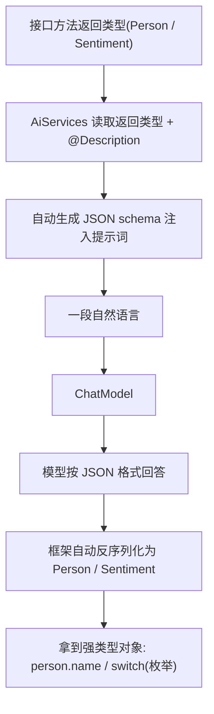

# 07 · Structured Outputs 结构化输出

> 本模块目标：让 AiService 接口方法直接返回 **Java 对象（POJO）** 或 **枚举（enum）**，
> 把一段自然语言自动抽取成强类型数据，告别手写 JSON 解析。

## 一、为什么需要结构化输出

大模型默认返回纯文本，程序拿来即用很麻烦。结构化输出让返回类型变成 POJO/枚举，框架替你完成两件事：

| 步骤 | 框架自动做的事 |
|---|---|
| 请求前 | 根据返回类型 + `@Description` 生成 JSON schema，注入提示词，要求模型按格式作答 |
| 响应后 | 把模型返回的 JSON 自动反序列化成你的 Java 对象 |

| 概念 | 说明 |
|---|---|
| 返回 POJO | 方法返回 `Person`，得到字段齐全的对象 |
| 返回 enum | 方法返回 `Sentiment`，模型只能选其中一个常量（天然的分类器） |
| `@Description` | `dev.langchain4j.model.output.structured.@Description`，给字段写说明，进入 schema，抽取更准 |

## 二、流程图



## 三、关键代码

```java
// 1) 目标 POJO：用 @Description 给字段写说明
public class Person {
    @Description("人物的姓名") public String name;
    @Description("人物的年龄，必须是整数") public int age;
    @Description("人物所在的城市") public String city;
    @Description("人物的兴趣爱好列表") public List<String> hobbies;
}

// 2) 分类用枚举
public enum Sentiment { POSITIVE, NEGATIVE, NEUTRAL }

// 3) 接口：返回类型直接写 POJO / enum
public interface InfoExtractor {
    @UserMessage("请从下面这段话中抽取人物信息：{{it}}")
    Person extractPerson(String text);

    @UserMessage("请判断下面这条评论的情感倾向：{{it}}")
    Sentiment classify(String review);
}

// 4) 使用：拿到的是强类型对象
InfoExtractor extractor = AiServices.create(InfoExtractor.class, model);
Person p = extractor.extractPerson("我叫李雷，28 岁，住上海，喜欢篮球");
System.out.println(p.name + " / " + p.hobbies);
Sentiment s = extractor.classify("太棒了，下次还来！"); // POSITIVE
```

## 四、运行

```bash
cd 07-structured-outputs
mvn spring-boot:run
```

## 五、小结

- 把 AiService 方法的返回类型写成 POJO/枚举，框架自动生成 schema 并反序列化。
- `@Description` 给字段写说明，能显著提升抽取准确率。
- 返回枚举是做文本分类的最简方式。
- 下一站：[08-tools](../08-tools) 让模型自动调用你写的 Java 方法（工具/函数调用）。
