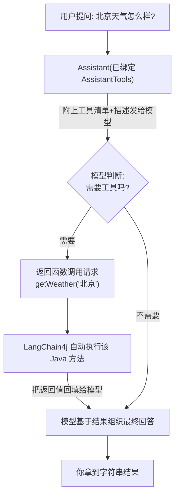

# 08 · Tools 工具 / 函数调用（Function Calling）

> 本模块目标：用 `@Tool` 把普通 Java 方法暴露给大模型，让模型在需要时**自动调用**它们——
> 这是把“只会聊天的 LLM”升级为“能办事的智能体”的关键一步。

## 一、为什么需要工具

大模型本身只会“生成文本”，它**算不准数学、查不到实时信息、连不上你的系统**。
工具调用让模型可以在回答前“先去调一个真实的 Java 方法拿结果”，从而做到既准确又实时。

| 没有工具 | 有工具 |
|---|---|
| “123+456 大概是 579 吧”（可能算错） | 自动调用 `add(123,456)` → 精确 579 |
| 编造一个天气 | 自动调用 `getWeather("北京")` → 真实数据 |

## 二、关键 API

| API | 包 | 作用 |
|---|---|---|
| `@Tool("描述")` | `dev.langchain4j.agent.tool.Tool` | 把方法标记为“可被模型调用的工具” |
| `@P("参数描述")` | `dev.langchain4j.agent.tool.P` | 描述工具方法的参数，帮模型正确填参 |
| `AiServices.builder(接口).tools(工具对象)` | `dev.langchain4j.service` | 把工具对象注册给 AI Service |

## 三、流程图



## 四、关键代码

```java
// 1) 写普通方法 + @Tool（@P 描述参数）
public class AssistantTools {
    @Tool("计算两个整数相加的和")
    public int add(@P("第一个加数") int a, @P("第二个加数") int b) { return a + b; }

    @Tool("查询指定城市的当前天气情况")
    public String getWeather(@P("城市名称，例如：北京") String city) { return city + "：晴 26℃"; }
}

// 2) 装配时用 .tools(...) 注册
Assistant assistant = AiServices.builder(Assistant.class)
        .chatModel(model)
        .tools(new AssistantTools())
        .build();

// 3) 正常提问，模型按需自动调用工具
String answer = assistant.chat("帮我算一下 123 加 456 等于多少？");
```

## 五、运行

```bash
cd 08-tools
mvn spring-boot:run
```

运行时观察控制台：出现 `>> [工具被调用] ...` 即说明模型确实自动调用了你的 Java 方法。

## 六、小结

- `@Tool` 让模型“长出手脚”，按需调用真实 Java 方法；整套函数调用协议由框架自动完成。
- 工具描述（`@Tool` / `@P` 的文字）就是“说明书”，写得越清楚模型用得越准。
- 下一站：[09-embeddings-and-stores](../09-embeddings-and-stores) 学习文本向量化与向量存储，为 RAG 打基础。
