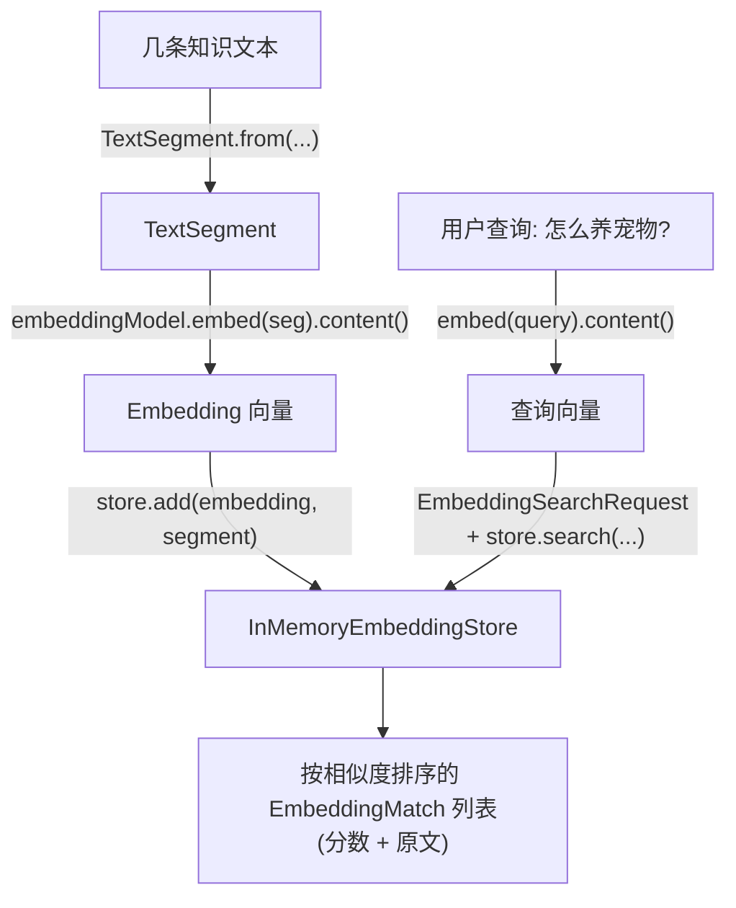

# 09 · Embeddings & Stores 向量化与向量存储

> 本模块目标：理解 **Embedding（向量化）** 和 **EmbeddingStore（向量存储）** 两块“RAG 的地基”，
> 学会把文本向量化、存入向量库，并做**语义检索**。

## 一、两个核心概念

| 概念 | 一句话理解 |
|---|---|
| **Embedding（向量）** | 把文本变成一串浮点数；语义越相近，向量在空间里越靠近 |
| **语义检索** | 把“查询”也变成向量，找出库里向量距离最近的几条原文 |

> 与“关键词搜索”的区别：关键词要字面命中；向量检索理解**语义**——
> 问“怎么养猫”能召回“宠物饲养指南”，即使一个相同的字都没有。

## 二、关键 API

| API | 包 | 作用 |
|---|---|---|
| `OpenAiEmbeddingModel.builder()` | `dev.langchain4j.model.openai` | 构建向量模型（连 OpenAI） |
| `TextSegment.from(text)` | `dev.langchain4j.data.segment` | 把字符串包装成可向量化/存储的片段 |
| `model.embed(seg).content()` | `dev.langchain4j.model.embedding` | 文本片段 → `Embedding` 向量 |
| `InMemoryEmbeddingStore<TextSegment>` | `dev.langchain4j.store.embedding.inmemory` | 内存向量库 |
| `store.add(embedding, segment)` | 同上 | 把“向量+原文”一起入库 |
| `EmbeddingSearchRequest.builder()` | `dev.langchain4j.store.embedding` | 构建检索请求（查询向量/条数/阈值） |
| `store.search(req).matches()` | 同上 | 返回按相似度降序的 `EmbeddingMatch` 列表 |

> 配置注入用 `embedding.*`（指向真正的 OpenAI），不是 `chat.*`（DeepSeek 不支持向量化）。

## 三、流程图



## 四、关键代码

```java
EmbeddingModel embeddingModel = OpenAiEmbeddingModel.builder()
        .baseUrl(baseUrl).apiKey(apiKey).modelName(modelName).build();

InMemoryEmbeddingStore<TextSegment> store = new InMemoryEmbeddingStore<>();

// 入库：文本 → 片段 → 向量 → 存入
TextSegment seg = TextSegment.from("猫咪每天需要充足饮水。");
Embedding emb = embeddingModel.embed(seg).content();
store.add(emb, seg);

// 检索：查询向量 → search
Embedding q = embeddingModel.embed("怎么照顾宠物？").content();
EmbeddingSearchRequest req = EmbeddingSearchRequest.builder()
        .queryEmbedding(q).maxResults(2).minScore(0.5).build();
List<EmbeddingMatch<TextSegment>> matches = store.search(req).matches();
matches.forEach(m -> System.out.println(m.score() + " → " + m.embedded().text()));
```

## 五、运行

```bash
cd 09-embeddings-and-stores
mvn spring-boot:run
```

> 真正运行需要 OpenAI 的 Key 与网络；本模块重点是理解 API，`mvn compile` 通过即达标。

## 六、小结

- 向量化把“语义”变成可计算的向量，向量库让“语义检索”变得简单高效。
- 这正是检索增强生成（RAG）的地基：先检索相关知识，再交给 LLM 作答。
- 下一站：[10-rag](../10-rag) 把向量检索与 AI Service 串起来，做一个真正的 RAG 问答助手。
