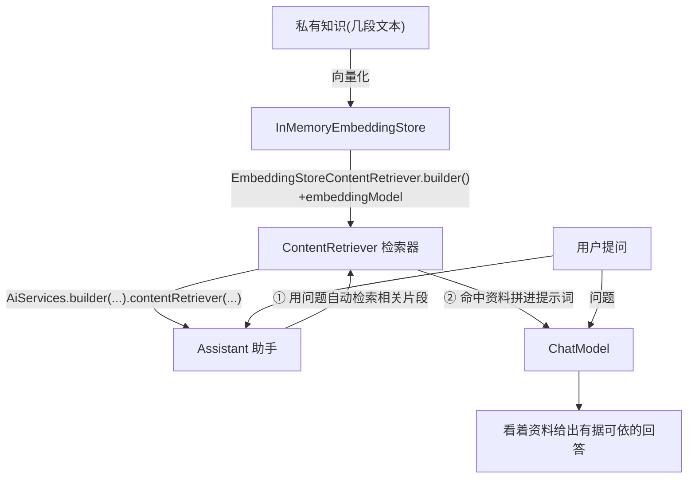

# 10 · RAG 检索增强生成（Retrieval-Augmented Generation）

> 本模块目标：把模块09 的“向量检索”与模块04 的“AI Service”串起来，做一个
> **先检索私有知识、再据此回答**的问答助手——这就是 RAG。

## 一、为什么需要 RAG

大模型只“记得”训练时见过的通用知识，**不了解你的私有资料**（公司制度、产品手册…），
还可能“一本正经地胡说八道”（幻觉）。RAG 的做法：

> 回答前，先从知识库**检索**最相关的几段资料 → **拼进提示词** → 让模型**看着资料生成**答案。

= Retrieval（检索）+ Augmented（增强）+ Generation（生成）。

| 收益 | 说明 |
|---|---|
| 能答私有/最新知识 | 模型本来不知道，靠检索补给它 |
| 减少幻觉 | 答案有据可依，而非凭空编造 |

## 二、关键 API

| API | 包 | 作用 |
|---|---|---|
| `InMemoryEmbeddingStore<TextSegment>` | `dev.langchain4j.store.embedding.inmemory` | 存放知识向量（见模块09） |
| `EmbeddingStoreContentRetriever.builder()` | `dev.langchain4j.rag.content.retriever` | 把“向量库+向量模型”打包成检索器 |
| `.embeddingStore(...)` / `.embeddingModel(...)` | 同上 | 指定从哪检索、用哪个模型向量化问题 |
| `.maxResults(n)` / `.minScore(d)` | 同上 | 每次召回几条、相似度阈值 |
| `AiServices.builder(接口).contentRetriever(检索器)` | `dev.langchain4j.service` | 把检索器接到 AI Service |

## 三、流程图



## 四、关键代码

```java
// 1) 知识向量化入库（同模块09）
InMemoryEmbeddingStore<TextSegment> store = new InMemoryEmbeddingStore<>();
TextSegment seg = TextSegment.from("全体员工每年享有 15 天带薪年假。");
store.add(embeddingModel.embed(seg).content(), seg);

// 2) 打包成检索器
ContentRetriever retriever = EmbeddingStoreContentRetriever.builder()
        .embeddingStore(store)
        .embeddingModel(embeddingModel)
        .maxResults(2)
        .minScore(0.5)
        .build();

// 3) 接到 AI Service 上
Assistant assistant = AiServices.builder(Assistant.class)
        .chatModel(chatModel)
        .contentRetriever(retriever)
        .build();

// 4) 提问：框架自动“先检索 → 拼提示词 → 再回答”
String answer = assistant.ask("公司员工每年有多少天年假？");
```

## 五、运行

```bash
cd 10-rag
mvn spring-boot:run
```

> 对话用 DeepSeek（chat.*），向量化用 OpenAI（embedding.*）；真正运行需对应 Key 与网络，
> 本模块重点是理解 RAG 装配，`mvn compile` 通过即达标。

## 六、小结

- RAG = 向量检索（模块09）+ AI Service（模块04），用 `.contentRetriever(...)` 一行接好。
- 检索+拼接对调用方透明：业务代码仍只是“调一个接口方法”。
- 下一站：[11-classification](../11-classification) 用 AI Service 返回枚举做文本分类。
