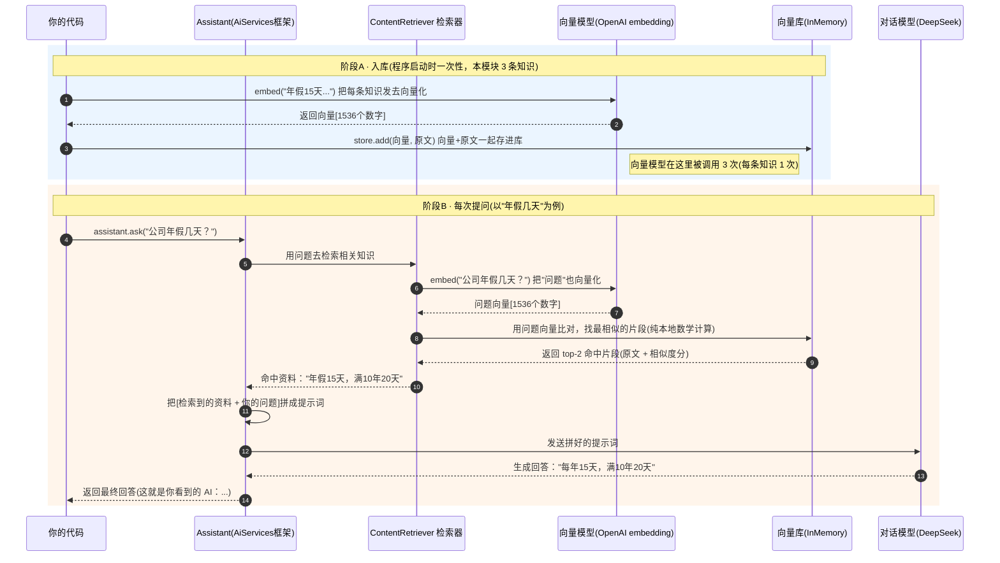

# RAG 中「向量模型」与「对话模型」到底如何协作？

> 本文解答一个高频疑惑：在 `10-rag` 模块里同时出现了**向量模型**和**对话模型**，
> 那最终的回答究竟是谁给的？向量模型既然也参与了，它能"回答"吗？对话模型又是干嘛的？
> 它们中间交互几次、交换了什么信息？本文用本模块的真实代码讲透。

---

## 一句话结论

**回答你问题的，自始至终都是「对话模型」(本模块用 DeepSeek)。**
**向量模型 (本模块用 OpenAI embedding) 从来不"回答"，它只做一件事：把文字变成一串数字(向量)，用于做"相似度搜索"。**

---

## 一、两个模型各自干什么

| 模型 | 角色比喻 | 能力 | 在本模块的职责 |
|---|---|---|---|
| **向量模型 EmbeddingModel**(OpenAI) | 图书管理员 / 搜索索引 | 把一段文字变成一串数字(向量)。**只能算"像不像"，不会说人话** | 给知识入库、把问题向量化以便检索 |
| **对话模型 ChatModel**(DeepSeek) | 答主 | 读懂资料 + 用人话组织回答 | **唯一真正"生成回答"的模型** |

> **关键澄清**：向量模型并不能"回答"。它的输出是类似 `[0.013, -0.21, 0.66, ...]` 这样 1536 个数字。
> 这串数字本身没法读，只能拿来和别的向量比"夹角/距离"，从而判断两段文字语义有多接近。
> 所以它只负责**检索(找资料)**，不负责**生成(写答案)**。

---

## 二、为什么需要两个模型配合（RAG 的本质）

对话模型 DeepSeek **不知道**"你公司年假几天"——这是你的私有知识，不在它的训练数据里。
直接问它，它要么瞎编，要么说不知道。

RAG（Retrieval-Augmented Generation，检索增强生成）的做法是：

> **先用向量模型从你的私有知识库里"搜"出相关段落，把这些段落塞进提示词，
> 再让对话模型"看着这些资料"回答。**

于是分工明确：**向量模型负责"找"，对话模型负责"读 + 写"**。

---

## 三、调用关系流程图（基于本模块代码）



---

## 四、各模型被调用几次、交换了什么（本模块精确计数）

### 阶段A — 入库（程序启动时只做一次）
- **向量模型被调用 3 次**：知识库有 3 条，每条执行一次 `embeddingModel.embed(segment)`。
  - 发出去：每段知识的文字 → 收回：该段的 1536 维向量。
- **对话模型 0 次**：入库阶段对话模型完全不参与。

对应代码：
```java
for (String text : knowledge) {                  // knowledge 有 3 条
    TextSegment segment = TextSegment.from(text);
    store.add(embeddingModel.embed(segment).content(), segment); // ← 向量模型在此被调用
}
```

### 阶段B — 每问一个问题
- **向量模型被调用 1 次**：把"问题"这句话向量化，用于和库里向量比相似度。
  - 发出去：你的问题文字 → 收回：问题的 1536 维向量。
  - 随后向量库做的是**纯本地数学计算**(算余弦相似度，不调用任何模型)，
    按 `maxResults(2)`、`minScore(0.5)` 选出最多 2 条、相似度 ≥ 0.5 的片段。
- **对话模型被调用 1 次**：接收"检索到的资料 + 原始问题"拼成的提示词，生成最终回答。
  - 发出去：类似 `已知资料:[年假15天...]。请回答:公司年假几天？` → 收回：人话答案。

对应代码：
```java
ContentRetriever contentRetriever = EmbeddingStoreContentRetriever.builder()
        .embeddingStore(store)
        .embeddingModel(embeddingModel)  // ← 问题向量化用它(每次提问调用 1 次)
        .maxResults(2)                   // 每次最多召回 2 条
        .minScore(0.5)                   // 相似度阈值
        .build();

Assistant assistant = AiServices.builder(Assistant.class)
        .chatModel(chatModel)                // ← 生成回答用它(每次提问调用 1 次)
        .contentRetriever(contentRetriever)  // ← 回答前自动检索
        .build();

assistant.ask("公司员工每年有多少天年假？");   // 触发：检索(向量模型1次) → 生成(对话模型1次)
```

### 本模块总计
本模块问了 3 个问题(年假、报销、班车)：
- 阶段B 合计：**向量模型 3 次、对话模型 3 次**。
- 加上阶段A 入库的 3 次：**整个程序跑完——向量模型 3 + 3 = 6 次，对话模型 3 次。**

---

## 五、特别说明：演示3「问班车」会怎样

知识库里**没有**班车信息。向量模型仍会把"班车"问题向量化去检索，
但**没有片段相似度 ≥ 0.5**（被 `minScore(0.5)` 卡掉），检索结果为空 →
对话模型收到"没有相关资料"的提示词 → 它会回答"资料中没有相关信息 / 不清楚"之类。

> 这正是 RAG 的优点：**答不出来时不容易瞎编**（对比直接问大模型容易胡诌）。

---

## 六、口诀（记住这三句就懂了）

1. **向量模型** = 搜索引擎的"索引 + 找资料"，只懂数字、不会说话；被调用多次（每条知识 1 次 + 每个问题 1 次）。
2. **对话模型** = 真正的"答主"，拿着找到的资料用人话回答；每个问题被调用 1 次。
3. 你在控制台看到的 `AI：…`，**100% 是对话模型(DeepSeek)输出的**；向量模型的功劳藏在"它替对话模型找对了资料"这一步。

---

> 配套代码见同目录 `src/main/java/.../RagRunner.java`；模块总览见 `README.md`。
