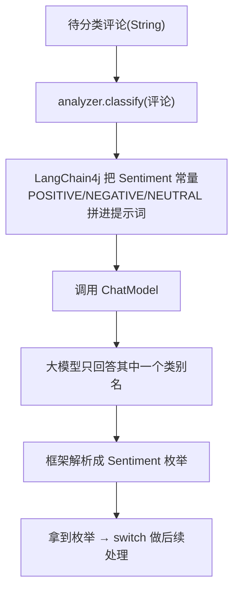

# 11 · 文本分类（情感分析）

> 本模块目标：用最轻量的方式做“文本分类”——让 **AiService 接口方法返回一个枚举（enum）**，
> LangChain4j 自动把类别选项写进提示词并把模型回答解析成枚举值。

## 一、什么是文本分类

把一段自然语言归到若干**预先定义好的类别**里。常见场景：

| 场景 | 类别集合 |
|---|---|
| 情感分析 | POSITIVE / NEGATIVE / NEUTRAL |
| 工单分类 | 售前 / 售后 / 投诉 / 其它 |
| 意图识别 | 查天气 / 订机票 / 闲聊 |

本模块以**情感分析**为例。

## 二、核心知识点

| 知识点 | 说明 |
|---|---|
| 返回 enum | AiService 方法返回类型是枚举时，框架自动约束模型“只能从常量里选” |
| 自动入提示词 | 枚举所有常量名会被拼进提示词，无需手写选项列表 |
| 自动解析 | 模型回答会被解析成对应的枚举常量返回 |
| 类型安全 | 返回值可被 `switch` 穷举，编译期就能保证处理了所有类别 |
| `temperature(0.0)` | 分类任务追求稳定，把温度调到最低 |

## 三、流程图



## 四、关键代码

```java
// 1) 定义类别集合（普通枚举）
public enum Sentiment { POSITIVE, NEGATIVE, NEUTRAL }

// 2) 声明分类接口：返回类型是枚举
interface SentimentAnalyzer {
    @SystemMessage("你是一个严谨的中文情感分析器……")
    @UserMessage("请分析下面这段文本的情感倾向：\n{{text}}")
    Sentiment classify(@V("text") String text);
}

// 3) 自动实现并调用
SentimentAnalyzer analyzer = AiServices.create(SentimentAnalyzer.class, model);
Sentiment s = analyzer.classify("这家餐厅太好吃了！"); // -> POSITIVE
```

## 五、运行

```bash
cd 11-classification
mvn spring-boot:run
```

> 需要在共享配置 `config/langchain4j-common.yml` 里填好 DeepSeek 的 `DEEPSEEK_API_KEY`。

## 六、小结

- 分类 = 定义一个 `enum` + 一个返回该枚举的 AiService 方法，其余交给框架。
- 这是“结构化输出”（模块07）的一个特例：把模型输出约束到有限取值。
- 下一站：[12-image-models](../12-image-models) 用文生图模型把文字变成图片。
