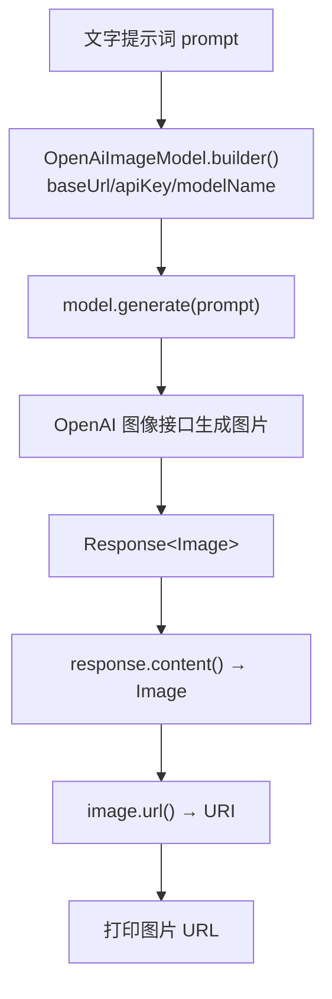

# 12 · 图像模型（文生图）

> 本模块目标：认识 **ImageModel**（图像模型），用 `OpenAiImageModel` 根据文字提示词
> 生成图片，并拿到图片的 URL。

## 一、ChatModel vs ImageModel

| 模型类型 | 输入 | 输出 | 典型实现 |
|---|---|---|---|
| ChatModel（前 11 个模块） | 文字 | 文字 | OpenAiChatModel |
| **ImageModel（本模块）** | 文字提示词 | 图片 | OpenAiImageModel（DALL·E） |

> 图像能力 DeepSeek 不支持，本模块连接参数用 `image.*` 一组（指向真正的 OpenAI）。

## 二、核心知识点

| 知识点 | 说明 |
|---|---|
| `OpenAiImageModel.builder()` | 构建文生图模型，支持 `size()` / `quality()` 等可选参数 |
| `Response<Image> generate(String)` | 传入提示词，返回包装了图片的 `Response` |
| `response.content()` | 取出 `Image` 对象 |
| `image.url()` | 返回 `java.net.URI`，图片下载地址（DALL·E 为临时 URL） |
| `image.revisedPrompt()` | DALL·E 3 会改写提示词后再画，这里能拿到改写版本 |

## 三、流程图



## 四、关键代码

```java
// 注入 image.* 参数（指向 OpenAI）
OpenAiImageModel model = OpenAiImageModel.builder()
        .baseUrl(baseUrl).apiKey(apiKey).modelName(modelName)
        .size("1024x1024").quality("standard")
        .build();

Response<Image> response = model.generate("一只戴宇航头盔的橘猫，卡通风格");
Image image = response.content();
URI url = image.url();                 // 图片下载地址
System.out.println(url);
System.out.println(image.revisedPrompt()); // 模型改写后的提示词
```

## 五、运行

```bash
cd 12-image-models
mvn spring-boot:run
```

> 真正生成图片需要有效的 `OPENAI_API_KEY`（会产生费用）。本模块按规范只要求编译通过；
> 未配置 Key 时调用 `generate(...)` 会报鉴权错误，属正常现象。

## 六、小结

- 图像模型是独立于对话模型的一类模型：文字进、图片出。
- 文生图三步：`builder()` 构建 → `generate(prompt)` 生成 → `content().url()` 取地址。
- 下一站：[13-guardrails](../13-guardrails) 给 AI 加“护栏”，拦截危险输入与不合规输出。
