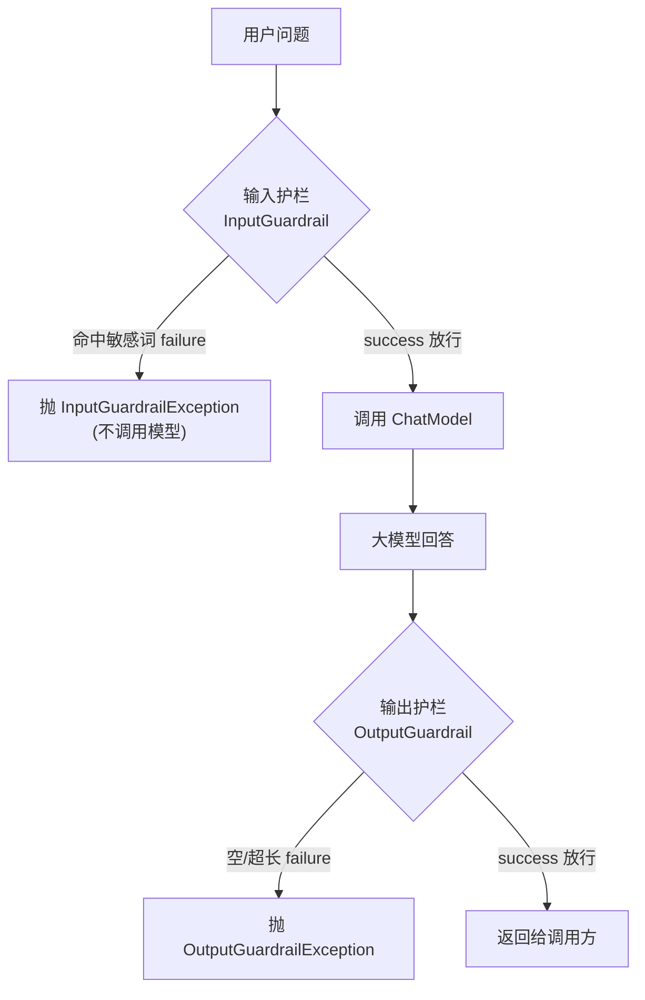

# 13 · 护栏（Guardrails）

> 本模块目标：给 AiService 加上 **输入护栏 / 输出护栏**——在调用大模型前后各设一道
> 校验关卡，拦截危险输入、把控不合规输出。这是把 LLM 安全落地到生产的关键手段。

## 一、两类护栏

| 护栏 | 接口（`dev.langchain4j.guardrail`） | 执行时机 | 入口方法 | 典型用途 |
|---|---|---|---|---|
| 输入护栏 | `InputGuardrail` | 调模型**之前** | `validate(UserMessage)` | 敏感词、注入攻击、超长输入 |
| 输出护栏 | `OutputGuardrail` | 拿到回答**之后** | `validate(AiMessage)` | 长度/格式校验、过滤泄露、JSON 合法性 |

## 二、核心知识点

| 知识点 | 说明 |
|---|---|
| `userMessage.singleText()` | 在输入护栏里取用户输入的纯文本 |
| `aiMessage.text()` | 在输出护栏里取模型回答的纯文本 |
| `success()` | 校验通过，放行 |
| `failure("原因")` | 校验失败，拦截（抛 `InputGuardrailException` / `OutputGuardrailException`） |
| `retry()` / `reprompt()` | 仅输出护栏：让模型重答（本模块未演示，仅作了解） |
| `@InputGuardrails({...})` | 注解（`dev.langchain4j.service.guardrail`），挂在接口方法上声明输入护栏 |
| `@OutputGuardrails({...})` | 同上，声明输出护栏，可设 `maxRetries` |

> 输入护栏命中即拦截，**根本不会调用大模型**——既安全又省钱。

## 三、流程图



## 四、关键代码

```java
// 1) 输入护栏：拦截敏感词
public class SensitiveWordInputGuardrail implements InputGuardrail {
    @Override
    public InputGuardrailResult validate(UserMessage userMessage) {
        String text = userMessage.singleText();
        if (text.contains("炸弹")) return failure("命中敏感词，已拦截");
        return success();
    }
}

// 2) 输出护栏：校验长度
public class LengthOutputGuardrail implements OutputGuardrail {
    @Override
    public OutputGuardrailResult validate(AiMessage responseFromLLM) {
        String text = responseFromLLM.text();
        if (text == null || text.isBlank()) return failure("回答为空");
        if (text.length() > 200) return failure("回答过长");
        return success();
    }
}

// 3) 挂到 AiService 接口方法上
interface GuardedAssistant {
    @InputGuardrails(SensitiveWordInputGuardrail.class)
    @OutputGuardrails(LengthOutputGuardrail.class)
    String ask(String question);
}
```

## 五、运行

```bash
cd 13-guardrails
mvn spring-boot:run
```

> 演示1（敏感词拦截）靠输入护栏即可生效、不需要网络；
> 演示2（正常提问）会真正调用大模型，需要配置 DeepSeek 的 `DEEPSEEK_API_KEY`。
> 本模块按规范只要求编译通过。

## 六、小结

- 护栏 = 给 AI 接口加“进/出”两道声明式校验关卡，是安全合规的标准做法。
- 输入护栏拦在调模型之前（省钱），输出护栏拦在回答之后（保质量）。
- 下一站：[14-observability-logging](../14-observability-logging) 给 AI 调用加上日志与可观测性。
