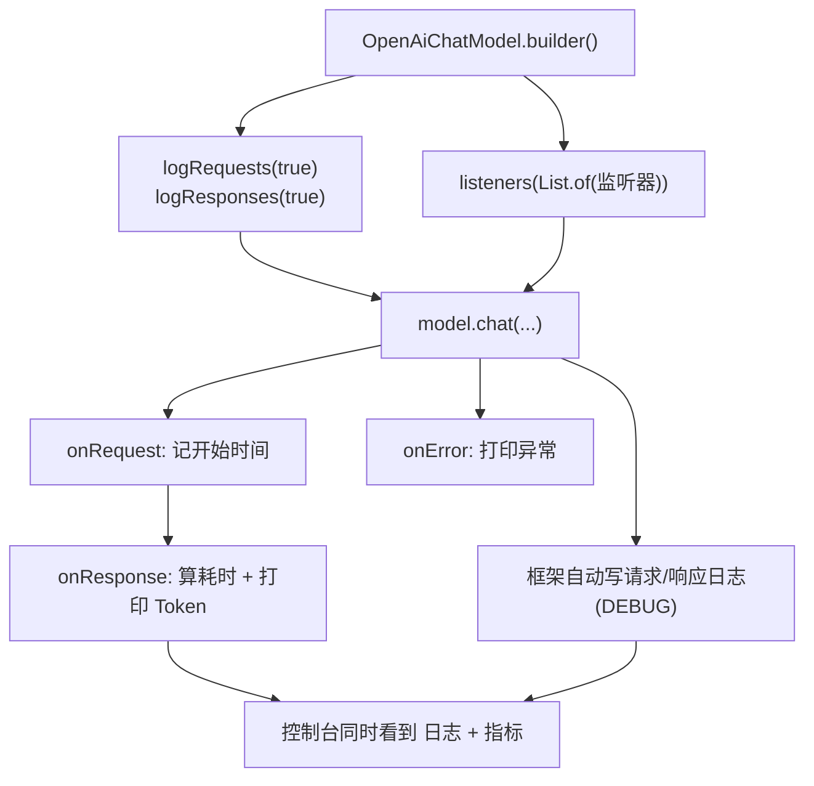

# 14 · 可观测性与日志（Observability & Logging）

> 本模块目标：给 LangChain4j 应用装上“仪表盘”——
> 既能看到每次请求/响应的原始内容（日志），又能统计耗时与 Token（监听器）。

## 一、为什么需要可观测性

生产环境里你必须能回答：发了什么请求？模型回了什么？耗时多久？花了多少 Token？有没有报错？
LangChain4j 提供两种互补的手段：

| 手段 | 怎么用 | 拿到什么 | 适合 |
|---|---|---|---|
| 内置日志 | `logRequests(true).logResponses(true)` | 给人看的文本（DEBUG 日志） | 开发期调试提示词与原始返回 |
| 模型监听器 | 实现 `ChatModelListener` + `listeners(...)` | 结构化对象（请求/响应/异常） | 生产级埋点、统计、告警 |

## 二、ChatModelListener 三个回调

| 回调 | 触发时机 | 关键入参 |
|---|---|---|
| `onRequest(ChatModelRequestContext)` | 发请求前 | `chatRequest()`、`modelProvider()`、`attributes()` |
| `onResponse(ChatModelResponseContext)` | 收响应后 | `chatResponse()`（含 `tokenUsage()`/`finishReason()`）、`attributes()` |
| `onError(ChatModelErrorContext)` | 出错时 | `error()` |

> 三个方法都是 `default`，只重写关心的即可。
> `attributes()` 是【同一次调用内共享】的 `Map`，因此可在 `onRequest` 存开始时间、在 `onResponse` 取出来算耗时。

## 三、流程图



## 四、关键代码

```java
// (1) 日志开关：框架自动打印请求体/响应体
ChatModel model = OpenAiChatModel.builder()
        .baseUrl(baseUrl).apiKey(apiKey).modelName(modelName)
        .logRequests(true)
        .logResponses(true)
        .build();

// (2) 监听器：统计耗时与 Token
public class MetricsChatModelListener implements ChatModelListener {
    @Override public void onRequest(ChatModelRequestContext ctx) {
        ctx.attributes().put("start", System.nanoTime());   // 存开始时间
    }
    @Override public void onResponse(ChatModelResponseContext ctx) {
        long cost = (System.nanoTime() - (Long) ctx.attributes().get("start")) / 1_000_000;
        TokenUsage usage = ctx.chatResponse().tokenUsage(); // 取 Token 用量
        // ... 打印 cost / usage
    }
    @Override public void onError(ChatModelErrorContext ctx) {
        // ctx.error() 上报告警
    }
}

ChatModel model = OpenAiChatModel.builder()
        .baseUrl(baseUrl).apiKey(apiKey).modelName(modelName)
        .listeners(List.of(new MetricsChatModelListener()))  // 注册
        .build();
```

## 五、运行

```bash
cd 14-observability-logging
mvn spring-boot:run
```

> 需配置有效的 DeepSeek/OpenAI Key 才能真正触发回调。
> 想看框架请求/响应日志，把日志级别调到 DEBUG（例如设置 `logging.level.dev.langchain4j=DEBUG`）。

## 六、小结

- 日志开关零成本，适合开发调试；监听器拿结构化数据，适合生产监控。
- `ChatModelListener` 用 `attributes()` 跨 `onRequest`/`onResponse` 传值，是计算耗时的标准做法。
- 下一站：[15-testing-and-evaluation](../15-testing-and-evaluation) 用“LLM 当裁判”自动评估回答质量。
