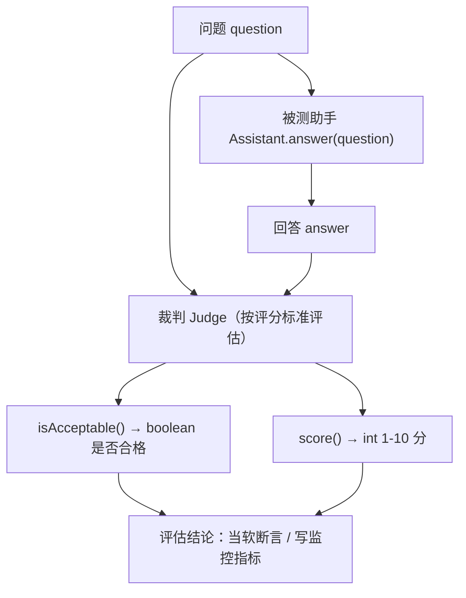

# 15 · 测试与评估（Testing & Evaluation）

> 本模块目标：理解为什么 LLM 应用不能用传统断言测试，
> 并掌握业界最常用的自动评估套路 **「LLM 当裁判」（LLM-as-a-Judge）**。

## 一、为什么 assertEquals 失效

| 传统软件 | LLM 应用 |
|---|---|
| 输入固定 → 输出固定 | 输出是自然语言，每次可能不同 |
| `assertEquals(expected, actual)` 直接判 | 没有唯一正确答案，无法精确比对 |
| 对就是对 | 需要评估“质量好不好”而非“是否完全相等” |

解决办法：再请【另一个大模型】当评委，按给定标准给出 **是否合格（boolean）** 或 **1-10 分（int）**。

## 二、关键设计

| 角色 | 实现 | 返回 |
|---|---|---|
| 被测助手 `Assistant` | AI Service 接口 | `String` 回答 |
| 裁判 `Judge` | AI Service 接口（`@SystemMessage` 设“评委”身份 + `@UserMessage` 写评分标准） | `boolean` / `int` |

> 裁判方法能直接返回 `boolean`/`int`，靠的是 AI Services 的结构化输出能力：
> 框架自动在提示词追加格式约束，并把模型文本解析成对应 Java 类型。

## 三、流程图



## 四、关键代码

```java
// 裁判接口：把评分标准写进提示词，返回结构化结果
interface Judge {
    @SystemMessage("你是一位严格、客观的回答质量评审...")
    @UserMessage("""
            请判断下面这条回答是否合格。合格标准：准确、切题、简洁...
            【问题】{{question}}
            【回答】{{answer}}
            合格只回 true，不合格只回 false。
            """)
    boolean isAcceptable(@V("question") String q, @V("answer") String a);

    @UserMessage("...只输出一个 1 到 10 的整数...")
    int score(@V("question") String q, @V("answer") String a);
}

// 用法：让助手回答，再让裁判打分
Assistant assistant = AiServices.create(Assistant.class, model);
Judge judge = AiServices.create(Judge.class, model);

String answer = assistant.answer(question);
boolean ok = judge.isAcceptable(question, answer);
int score   = judge.score(question, answer);
```

## 五、运行

```bash
cd 15-testing-and-evaluation
mvn spring-boot:run
```

> 需配置有效的 DeepSeek/OpenAI Key 才能真正打分。

## 六、小结

- LLM 输出不唯一，传统 `assertEquals` 失效；用「LLM 当裁判」做自动质量评估。
- 裁判也是 AI Service：把评分标准写进 `@UserMessage`，用 `boolean`/`int` 返回结构化结论。
- 这套机制是回归测试、A/B 选模型、线上质量打分的基础。
- 下一站：[16-mcp](../16-mcp) 接入 MCP 远程工具，让模型调用外部能力。
