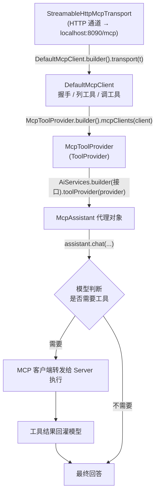

# 16 · MCP 模型上下文协议客户端

> 本模块目标：理解 **MCP（Model Context Protocol）** 的价值，并学会用 LangChain4j
> 作为 MCP 客户端，连接远程 MCP Server，把它暴露的工具交给大模型自动调用。

## 一、MCP 是什么

MCP 是 Anthropic 提出的开放协议，标准化“大模型 ↔ 外部工具/数据源”的通信，常被比喻为
**“给 AI 用的 USB 接口”**。

| 对比 | 模块 08 的 `@Tool` | 本模块的 MCP 工具 |
|---|---|---|
| 工具定义在哪 | 写死在你的 Java 代码里 | 独立运行的 MCP Server 里 |
| 复用性 | 仅本应用可用 | 任何 MCP 客户端即插即用 |
| 热插拔 | 改代码、重新编译 | 启停 Server 即可，应用不动 |
| 典型场景 | 简单、私有的小工具 | 文件系统、数据库、浏览器、第三方 API 等 |

## 二、关键类（来自 `langchain4j-mcp`，版本 `1.17.0-betaXX` 由 BOM 管理）

| 类 / 接口 | 作用 |
|---|---|
| `StreamableHttpMcpTransport` | 基于 HTTP(SSE) 的传输通道（还有 `HttpMcpTransport`/`StdioMcpTransport`/`WebSocketMcpTransport`） |
| `DefaultMcpClient` | MCP 客户端：与 Server 握手、列工具、调工具 |
| `McpToolProvider` | 把远程工具适配成 LangChain4j 的 `ToolProvider` |
| `AiServices.builder(...).toolProvider(...)` | 把远程工具交给模型（区别于 `.tools(本地对象)`） |

## 三、流程图



## 四、关键代码

```java
// 1) 传输通道（指向远程 MCP Server）
McpTransport transport = StreamableHttpMcpTransport.builder()
        .url("http://localhost:8090/mcp")
        .timeout(Duration.ofSeconds(20))
        .build();

// 2) MCP 客户端（build() 时完成握手）
McpClient mcpClient = new DefaultMcpClient.Builder()
        .transport(transport)
        .build();

// 3) 远程工具 → ToolProvider
ToolProvider toolProvider = McpToolProvider.builder()
        .mcpClients(mcpClient)
        .build();

// 4) 交给模型（注意是 toolProvider，不是 tools）
McpAssistant assistant = AiServices.builder(McpAssistant.class)
        .chatModel(model)
        .toolProvider(toolProvider)
        .build();
```

## 五、运行

> ⚠️ 本模块需要一个运行在 `http://localhost:8090` 的 MCP Server，否则会连接失败。
> 演示代码已用 `try/catch` 包裹，未启动 Server 时会友好提示，不影响编译验收。

先起一个 MCP Server（任选其一）：

- **官方/社区现成 Server**：例如文件系统 Server `npx -y @modelcontextprotocol/server-filesystem`，
  再用支持 Streamable HTTP 的网关把它暴露到 `localhost:8090/mcp`。
- **自己写**：用 `langchain4j-mcp` 的服务端能力或任意 MCP SDK 实现一个 HTTP MCP Server，监听 8090。

然后运行本模块：

```bash
cd 16-mcp
mvn spring-boot:run
```

## 六、小结

- MCP 让“工具”从应用代码中解耦出来，变成可独立运行、可被任意客户端复用的远程服务。
- LangChain4j 接 MCP 的三件套：`Transport` → `DefaultMcpClient` → `McpToolProvider`，
  最后用 `AiServices...toolProvider(...)` 交给模型。
- 下一站：[17-agents](../17-agents) 把“模型 + 工具 + 记忆 + 循环”组合成真正的智能体。
