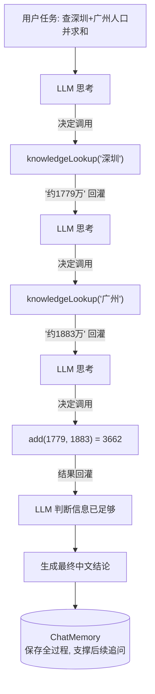

# 17 · Agents 智能体

> 本模块目标：理解 **Agent（智能体）** 的本质，并用最稳定的
> `AiServices + @Tool + ChatMemory` 组合，亲手搭出一个能“多步推理、自主调用工具”的研究助手。

## 一、什么是 Agent

普通“一问一答”只调用一次模型；Agent 则能为完成一个目标**自主多步行动**：
思考 → 调用工具 → 观察结果 → 再思考 → 再调用 → … → 给出最终答案。

一句话公式：

> **Agent = LLM（大脑） + Tools（手脚） + Memory（记忆） + Loop（循环）**

| 组成 | 角色 | 本模块用什么 |
|---|---|---|
| LLM | 决策“下一步做什么” | `OpenAiChatModel`（DeepSeek） |
| Tools | 模型不具备的能力（算数、查数据） | `@Tool` 方法（`ResearchTools`） |
| Memory | 记住历史与中间结果 | `MessageWindowChatMemory` |
| Loop | 调用-观察-再决策的循环 | 由 `AiServices` **自动驱动** |

## 二、流程图



## 三、关键代码

```java
// 工具（手脚）
public class ResearchTools {
    @Tool("根据城市名查询人口资料")
    String knowledgeLookup(@P("城市名") String city) { ... }

    @Tool("计算两个整数的和")
    long add(@P("加数a") long a, @P("加数b") long b) { ... }
}

// 接口（人设里明确允许多步用工具）
interface ResearchAgent {
    @SystemMessage("你是研究助手，可连续多步调用工具：先查资料、再计算、最后汇总。")
    String research(String task);
}

// 组装：模型 + 工具 + 记忆（循环由 AiServices 自动驱动）
ResearchAgent agent = AiServices.builder(ResearchAgent.class)
        .chatModel(model)
        .tools(new ResearchTools())
        .chatMemory(MessageWindowChatMemory.withMaxMessages(20))
        .build();
```

## 四、运行

```bash
cd 17-agents
mvn spring-boot:run
```

运行时可在控制台看到 `[工具被调用] ...` 的打印，直观展现智能体的多步推理过程。

> 说明：本模块刻意采用**稳定**的 `AiServices + tools + memory` 方式来构建 Agent。
> LangChain4j 另有实验性的 `agentic` 模块（多智能体编排、工作流），API 仍在演进，
> 入门阶段用本方式即可覆盖绝大多数“单智能体多步推理”的需求。

## 五、小结

- Agent 的核心不是某个新 API，而是 **LLM + 工具 + 记忆 + 循环** 的组合思想。
- LangChain4j 用 `AiServices` 自动驱动“调用工具-观察结果-再决策”的循环，你只需把三样东西装配好。
- 下一站：[18-spring-boot-integration](../18-spring-boot-integration) 用官方 Spring Boot starter
  让一切自动配置化，把 LangChain4j 真正融入 Spring 生态。
