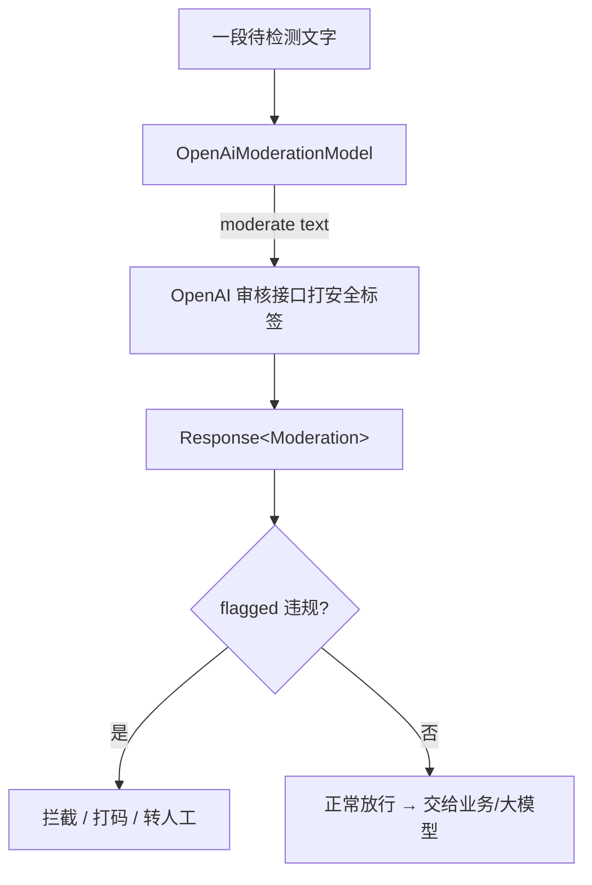

# 19 · 内容审核（Moderation）

> 本模块目标：理解「内容审核」这一独立能力——用 AI 自动检查一段文字是否包含违规/有害内容。

## 一、内容审核是什么

互联网应用里到处是用户输入的文字（评论、弹幕、私信……），里面可能有**辱骂、暴力、色情、仇恨、自残**等不良内容，靠人工一条条看根本看不过来。

**内容审核**就是：把一段文字丢给专门的**审核模型**，它告诉你这段话有没有问题、问题出在哪段文字。

> 注意区分两类模型：
> - **对话模型（ChatModel）**：你问它答，用来“聊天/干活”。
> - **审核模型（ModerationModel）**：不聊天，只做一件事——给文字打“安全标签”。

## 二、它返回什么

LangChain4j 的 `moderate(text)` 返回 `Response<Moderation>`，核心字段：

| 方法 | 含义 |
|---|---|
| `moderation.flagged()` | 是否被判定为违规（true/false） |
| `moderation.flaggedText()` | 被标记的那段文字（未违规时通常为 null） |

## 三、流程图



## 四、典型用途

1. **UGC 过滤**：评论/社区内容发布前先审，违规的拦下来。
2. **合规风控**：把用户的话喂给大模型前先审，防止有人用越界内容诱导 AI。
3. **出站兜底**：连大模型自己生成的回答也再审一遍，双保险。

## 五、关键代码

```java
ModerationModel model = OpenAiModerationModel.builder()
        .baseUrl(baseUrl).apiKey(apiKey).modelName(modelName)
        .build();

Response<Moderation> response = model.moderate("待检测文字");
Moderation m = response.content();
if (m.flagged()) {
    // 违规：m.flaggedText() 是被标记片段
}
```

## 六、运行

> ⚠️ 内容审核**只有 OpenAI 支持，DeepSeek 不支持**。需要有效的 `OPENAI_API_KEY`。
> 若账户无额度会返回 HTTP 429（insufficient_quota）——这是账户问题，不是代码问题。

```bash
cd 19-moderation
mvn spring-boot:run
```

## 七、小结

- 内容审核是一个**独立的专用模型**，只负责给文字打安全标签。
- 用 `ModerationModel.moderate(text)` 即可，看 `flagged()` 判断是否违规。
- 这是 LangChain4j 项目的最后一个模块，与 spring-ai-learning 的 `20-moderation` 对齐。
