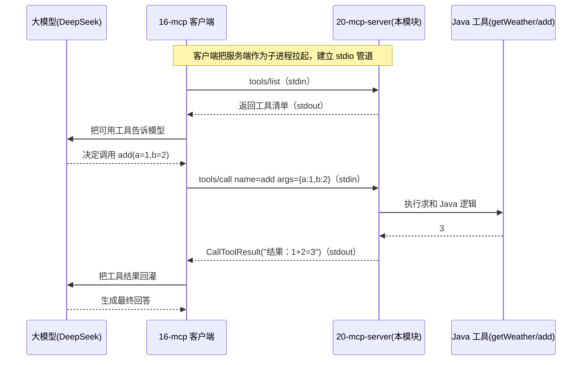

# 20 · MCP 服务端（与 16 客户端配对成闭环）

> 本模块目标：用 **官方 MCP Java SDK** 写一个 **stdio 传输** 的 MCP 服务端，对外暴露工具（tool）。
> 它和模块 16 的 MCP 客户端正好是一对：**16 是「用工具的人」，20 是「造工具、摆摊的人」**。

## 一、要懂的核心概念

| 概念 | 大白话解释 |
|---|---|
| **MCP 服务端** | 一个把自家能力按 MCP 规范包装成「工具」对外发布的程序，任何 MCP 客户端都能连上来调用。 |
| **工具 (tool)** | 服务端发布的一个可调用能力。由「说明书(`Tool`：名称+描述+入参 JSON Schema)」+「处理器(真正执行的 Java 逻辑)」两部分组成。 |
| **stdio 传输** | 把服务端当成命令行子进程：客户端往它的 **stdin** 写 JSON-RPC 请求，服务端从 **stdout** 写 JSON-RPC 响应。 |
| **JSON-RPC 2.0** | MCP 底层的消息格式（`tools/list` 列工具、`tools/call` 调工具）。 |
| **官方 MCP Java SDK** | `io.modelcontextprotocol.sdk:mcp`。LangChain4j 的 `langchain4j-mcp` 只做**客户端**，写**服务端**要用这套官方 SDK。 |

> ⚠️ **stdio 铁律**：stdio 服务端**绝不能往 stdout 打普通日志**，否则会污染 JSON-RPC 流。
> 本模块所有人类可读提示都走 `System.err`，并在 `application.yml` 里关掉了 Spring banner。

## 二、闭环流程图



## 三、关键代码

```java
// 1) MCP 的 JSON 编解码器（基于 Jackson）
McpJsonMapper jsonMapper = new JacksonMcpJsonMapper(new ObjectMapper());

// 2) stdio 传输：默认用 System.in / System.out 收发 JSON-RPC
StdioServerTransportProvider transport = new StdioServerTransportProvider(jsonMapper);

// 3) 工具说明书：名称 + 描述 + 入参 JSON Schema
McpSchema.Tool addTool = McpSchema.Tool.builder()
        .name("add").description("计算两个数字之和")
        .inputSchema(jsonMapper, """
            {"type":"object","properties":{
               "a":{"type":"number"},"b":{"type":"number"}},
             "required":["a","b"]}""")
        .build();

// 4) 组装并启动同步服务端，注册工具（处理器：参数Map -> CallToolResult）
McpSyncServer server = McpServer.sync(transport)
        .serverInfo("lc4j-learning-20-mcp-server", "1.0.0")
        .capabilities(McpSchema.ServerCapabilities.builder().tools(true).build())
        .tool(addTool, (exchange, args) -> {
            double a = ((Number) args.get("a")).doubleValue();
            double b = ((Number) args.get("b")).doubleValue();
            return new McpSchema.CallToolResult("结果：" + (a + b), false);
        })
        .build();   // 之后 stdio 传输开始监听 stdin
```

## 四、用到的依赖与版本

```xml
<!-- 官方 MCP Java SDK（不在 langchain4j-bom 里，需显式写 version） -->
<dependency>
    <groupId>io.modelcontextprotocol.sdk</groupId>
    <artifactId>mcp</artifactId>
    <version>0.18.2</version>   <!-- 本模块验证可编译的版本；mcp 会带上 mcp-core + mcp-json-jackson2 -->
</dependency>
```

## 五、怎么运行

本项目只要求 `mvn -q compile` 通过。真正联调有两种常见方式：

**方式一：被 MCP 客户端作为子进程拉起（最贴近真实用法）**
先把本模块打成可运行 jar：
```bash
cd 20-mcp-server
mvn -q -DskipTests package
```
然后在 16-mcp 客户端里改用 **stdio 传输**（`StdioMcpTransport`），命令指向本 jar，例如：
```
command = ["java", "-jar", "/绝对路径/20-mcp-server/target/20-mcp-server-1.0.0.jar"]
```
客户端启动时会把这条命令作为子进程拉起，通过 stdin/stdout 完成握手、列工具、调工具。

**方式二：手动启动 + MCP Inspector 调试**
```bash
java -jar target/20-mcp-server-1.0.0.jar
```
进程通过 stdin/stdout 等待连接。用官方 [MCP Inspector](https://github.com/modelcontextprotocol/inspector) 以 stdio 方式连上，即可在网页里看到 `getWeather` / `add` 两个工具并手动调用。

> 提示：当前 Runner 演示构建并打印工具清单后就返回（满足「编译通过」目标）。
> 若想让进程常驻以便 Inspector 连接，把 Runner 末尾改成 `Thread.currentThread().join();` 即可。

## 六、小结

- MCP **服务端**用官方 `io.modelcontextprotocol.sdk:mcp` 构建；LangChain4j 只管客户端。
- 一个工具 = `McpSchema.Tool`（说明书）+ 处理器（`(exchange, args) -> CallToolResult`）。
- **stdio 传输** = 用进程 stdin/stdout 传 JSON-RPC；服务端禁止往 stdout 打日志。
- 它与模块 16 客户端配对：`tools/list` 发现 → 模型决策 → `tools/call` 执行 → 结果回灌，形成完整闭环。
