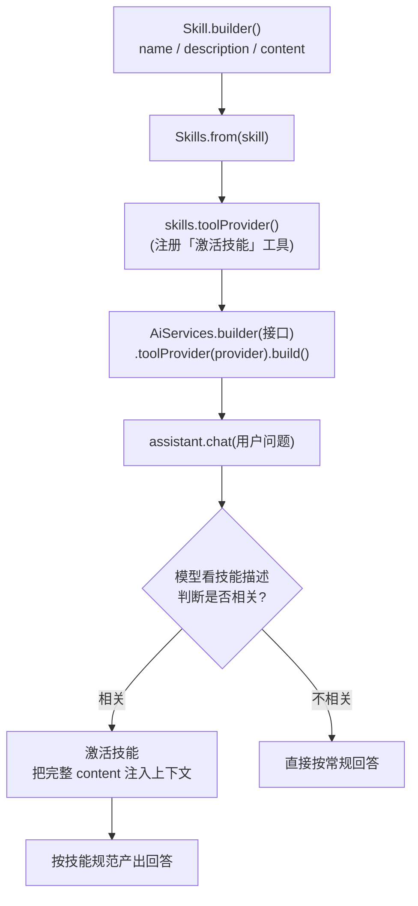

# 21 · Skills（技能）

> 本模块目标：用 **langchain4j-skills** 给一个 AI Service 装配「技能(Skill)」，
> 体会技能的核心价值——**渐进式披露(progressive disclosure)**：详细说明书「按需加载」而非「全程常驻」。

## 一、要懂的核心概念

| 概念 | 大白话解释 |
|---|---|
| **Skill（技能）** | 一整套「教模型怎么做某件事」的打包知识：`name` + `description` + `content`（详细指南，可很长），可选附带 `resources` / `tools`。 |
| **渐进式披露** | 平时只把每个技能的**简短描述**放进上下文（省 token）；模型判断需要时才**激活**它，把完整 `content` 注入上下文。 |
| **Skills** | 技能集合。`Skills.from(...)` 聚合多个技能，`toolProvider()` 把它们适配成一个「激活技能」工具交给模型。 |
| **Skill vs Tool** | Tool 给模型「手脚」（执行动作、返回结果）；Skill 给模型「说明书」（按需加载的指令/知识）。 |

## 二、流程图



## 三、关键代码

```java
// 1) 定义技能：description 平时常驻；content 只有被激活后才注入(渐进式披露)
Skill skill = Skill.builder()
        .name("weekly-report-writer")
        .description("把零散的工作记录整理成符合公司规范的标准周报")
        .content("""
                # 周报写作规范
                必须包含三个小节：## 本周完成 / ## 存在问题 / ## 下周计划
                每条要点不超过 30 字；「本周完成」每条结尾加 ✅ …
                """)
        .build();

// 2) 聚合技能，取出 ToolProvider（含「激活技能」工具）
Skills skills = Skills.from(skill);
ToolProvider provider = skills.toolProvider();

// 3) 装到 AI Service 上（与模块16同样走 .toolProvider）
SkillsAssistant assistant = AiServices.builder(SkillsAssistant.class)
        .chatModel(model)
        .toolProvider(provider)
        .build();

// 4) 提问：模型会先激活技能读到规范，再按规范输出周报
String answer = assistant.chat("帮我写本周周报：完成了登录模块和单元测试……");
```

## 四、用到的依赖与版本

```xml
<dependency>
    <groupId>dev.langchain4j</groupId>
    <artifactId>langchain4j-skills</artifactId>
    <!-- 无需写 version：由 langchain4j-bom 统一管理，实际解析为 1.17.0-beta27 -->
</dependency>
```
> 说明：`langchain4j-skills` 在 1.17.0 里仍是 **beta**（BOM 把它锁定为 `1.17.0-beta27`），API 可能随版本调整。本模块按当前 beta27 的真实 API 编写并已通过编译。

## 五、怎么运行

本项目只要求 `mvn -q compile` 通过。真正运行：
1. 在 `../config/langchain4j-common.yml` 配好 **DeepSeek 的 Key**（`langchain4j.openai.chat.*`）。
2. 执行：
```bash
cd 21-skills
mvn spring-boot:run
```
未配置 Key 时程序不会崩溃，会打印友好提示（调用被 try/catch 包裹）。

## 六、小结

- 引入 `langchain4j-skills`，用 `Skill.builder()` 把一套「说明书」打包成技能。
- `Skills.from(...).toolProvider()` 得到一个「激活技能」工具，再通过 `AiServices` 的 `.toolProvider(...)` 装上。
- 核心价值是**渐进式披露**：只让简短描述常驻、完整指南按需激活，既省 token 又能在需要时给模型精确指导。
- 与模块 08 的 `@Tool` 对照理解：Tool 让模型「做动作」，Skill 让模型「读说明书」（且可捆绑自己的工具）。
