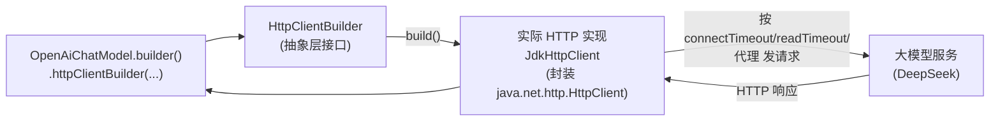

# 23 · 底层 HTTP 客户端定制（Customizable HTTP Client）

> 本模块目标：理解 LangChain4j“怎么发 HTTP”这一层是可替换的，
> 并学会显式指定一个自定义 `HttpClientBuilder` 交给对话模型。
> 对应官方 Tutorials「Customizable HTTP Client」。

## 一、为什么要定制 HTTP 客户端

调用大模型本质就是发 HTTP 请求。生产环境常需要对这一层做精细控制：

| 诉求 | 说明 |
|---|---|
| **超时控制** | 设连接超时 / 读超时，避免请求挂死拖垮线程池 |
| **代理** | 公司内网必须走 HTTP 代理才能访问外网大模型 |
| **连接池/复用** | 高并发下复用连接，提升吞吐、降低 TLS 握手开销 |
| **基础设施统一** | 与公司既有 HTTP 栈（监控、链路追踪、TLS）保持一致 |

## 二、三种变体（不同 Maven 依赖）

| 依赖 | 提供什么 |
|---|---|
| `langchain4j-http-client` | 抽象层：`HttpClient` / `HttpClientBuilder` 接口 + SPI |
| `langchain4j-http-client-jdk` | 用 Java 17 自带 `java.net.http.HttpClient` 实现（**本模块用它**） |
| `langchain4j-http-client-okhttp` | 用 OkHttp 实现（生态成熟、连接池强） |

> 模型只依赖抽象接口 `HttpClientBuilder`，所以换实现（JDK ↔ OkHttp）业务代码一行不改。

## 三、流程图



## 四、关键代码

```java
// 1) 定制底层 JDK 原生 HttpClient.Builder（代理、重定向、HTTP 版本等）
java.net.http.HttpClient.Builder jdkBuilder = HttpClient.newBuilder()
        .followRedirects(HttpClient.Redirect.NORMAL)
        .version(HttpClient.Version.HTTP_2);

// 2) 包成 LangChain4j 的 JdkHttpClientBuilder，设连接/读超时
JdkHttpClientBuilder httpClientBuilder = new JdkHttpClientBuilder()
        .httpClientBuilder(jdkBuilder)
        .connectTimeout(Duration.ofSeconds(10))  // 建立连接最多等 10s
        .readTimeout(Duration.ofSeconds(60));     // 等服务器返回最多 60s

// 3) 显式交给模型——之后每次请求都走这个 HTTP 客户端
ChatModel model = OpenAiChatModel.builder()
        .baseUrl(baseUrl).apiKey(apiKey).modelName(modelName)
        .httpClientBuilder(httpClientBuilder)
        .build();

String answer = model.chat("...");
```

### 关键 API（javap 查证）

- `dev.langchain4j.http.client.HttpClientBuilder`：接口，含
  `connectTimeout(Duration)` / `readTimeout(Duration)` / `build()`。
- `dev.langchain4j.http.client.jdk.JdkHttpClientBuilder`：实现该接口，额外提供
  `httpClientBuilder(java.net.http.HttpClient.Builder)` 注入底层旋钮。
- `OpenAiChatModel.OpenAiChatModelBuilder.httpClientBuilder(HttpClientBuilder)`：模型上的接入点。

## 五、运行

```bash
cd 23-http-client
mvn spring-boot:run
```

> 会真实调用 DeepSeek，需要配好 chat 的 Key。能正常拿到回答即证明自定义 HTTP 客户端生效。

## 六、小结

- “怎么发 HTTP”是独立可替换的一层：抽象接口 + JDK/OkHttp 等实现。
- 用 `JdkHttpClientBuilder` 设超时/代理等，再用 `.httpClientBuilder(...)` 交给模型。
- 面向接口编程，换实现不动业务代码。
- 上一站：[22-json-codec](../22-json-codec) 定制底层 JSON 编解码。
