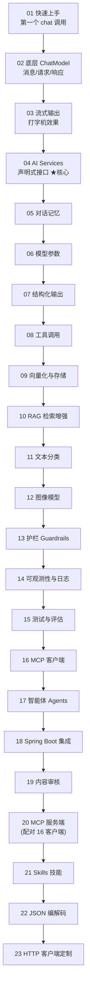

# LangChain4j 零基础学习项目

> 一个面向**零基础 Java 开发者**的 LangChain4j 教程项目。按官方文档 [Tutorials](https://docs.langchain4j.dev/) 的知识点循序渐进，**一个知识点一个独立可运行的模块**，全程详细中文注释 + 流程图。
>
> 姊妹项目：`spring-ai-learning`（用 Spring AI 讲同类知识）。本项目用 **LangChain4j** 原生 API。

## 技术栈

| 组件 | 版本 | 说明 |
|---|---|---|
| Java | 17 | LangChain4j 1.x 最低要求 |
| LangChain4j | 1.17.0 | 核心 AI 库（对标 Python LangChain） |
| Spring Boot | 3.5.4 | 仅作“运行外壳”：启动类 + CommandLineRunner + 读取共享配置 |

> 说明：真正的 AI 调用全部用 **LangChain4j 原生 API**；Spring Boot 只负责启动和读配置，
> 让每个模块都能 `mvn spring-boot:run` 一键演示。最后的 18 号模块专门演示 LangChain4j 官方的 Spring Boot 集成。

## 模型策略（与 spring-ai-learning 一致）

- 统一用 LangChain4j 的 OpenAI 集成（`langchain4j-open-ai`），因为 **DeepSeek 接口兼容 OpenAI**。
- **对话(chat)** → 指向 DeepSeek（便宜、国内可直连，`deepseek-chat`）。
- **向量(embedding) / 图片(image)** → DeepSeek 不支持，指向真正的 OpenAI。
- 所有 Key/地址只在 `config/langchain4j-common.yml` 配**一处**，各模块通过 `spring.config.import` 导入。

### 配置 API Key（二选一）

```bash
# 方式A（推荐）：设置环境变量
export DEEPSEEK_API_KEY=sk-你的deepseek密钥
export OPENAI_API_KEY=sk-你的openai密钥
```

或直接编辑 `config/langchain4j-common.yml` 里的默认值。
> 想零成本试跑对话：把共享配置 chat 段改成演示代理 `base-url=http://langchain4j.dev/demo/openai/v1`、`api-key=demo`、`model=gpt-4o-mini`。

## 学习路线（按顺序）



| # | 模块 | 知识点 |
|---|---|---|
| 01 | [01-get-started](01-get-started) | 核心概念 + 第一个 ChatModel 调用 |
| 02 | [02-chat-and-language-models](02-chat-and-language-models) | 底层 API：消息类型、ChatRequest/ChatResponse、Token 用量 |
| 03 | [03-response-streaming](03-response-streaming) | 流式输出（StreamingChatModel + 回调） |
| 04 | [04-ai-services](04-ai-services) | AI Services 声明式高级 API（最常用） |
| 05 | [05-chat-memory](05-chat-memory) | 对话记忆，让 AI 记住上下文 |
| 06 | [06-model-parameters](06-model-parameters) | 模型参数：temperature / maxTokens / topP |
| 07 | [07-structured-outputs](07-structured-outputs) | 结构化输出：把回答转成 Java 对象 |
| 08 | [08-tools](08-tools) | 工具 / 函数调用 @Tool |
| 09 | [09-embeddings-and-stores](09-embeddings-and-stores) | 文本向量化 + 向量存储与语义检索 |
| 10 | [10-rag](10-rag) | 检索增强生成 RAG |
| 11 | [11-classification](11-classification) | 文本分类 |
| 12 | [12-image-models](12-image-models) | 图像模型：文生图 |
| 13 | [13-guardrails](13-guardrails) | 护栏：输入/输出校验 |
| 14 | [14-observability-logging](14-observability-logging) | 可观测性 + 日志 |
| 15 | [15-testing-and-evaluation](15-testing-and-evaluation) | 测试与评估（LLM 当裁判） |
| 16 | [16-mcp](16-mcp) | 模型上下文协议 MCP 客户端 |
| 17 | [17-agents](17-agents) | 构建智能体 |
| 18 | [18-spring-boot-integration](18-spring-boot-integration) | LangChain4j 的 Spring Boot 集成（starter + @AiService） |
| 19 | [19-moderation](19-moderation) | 内容审核：检测文本是否含违规内容（需 OpenAI） |
| 20 | [20-mcp-server](20-mcp-server) | MCP 服务端（stdio），与 16 客户端配对成闭环 |
| 21 | [21-skills](21-skills) | Skills 技能：渐进式披露的能力包 |
| 22 | [22-json-codec](22-json-codec) | JSON 编解码定制（对话历史序列化等） |
| 23 | [23-http-client](23-http-client) | 底层 HTTP 客户端定制（超时/代理/连接池） |

## 怎么运行任意模块

```bash
# 在某个模块目录下
cd 01-get-started
mvn spring-boot:run
```

或在根目录一次性编译全部模块：

```bash
mvn -q compile
```

## 关于本项目覆盖范围

本项目覆盖 LangChain4j 官方 Tutorials 的**核心知识点**。官方文档另有若干**平台/语言集成**章节（Kotlin、Quarkus、Micronaut、Helidon、Payara 等）属于特定运行环境，未单独建模块；其思路与 18 号 Spring Boot 集成相通，需要时可参考[官方文档](https://docs.langchain4j.dev/)。

## 小结

- LangChain4j 让 Java 开发者用统一 API 接入各家大模型，构建对话、RAG、工具、智能体等应用。
- 推荐学习顺序：01 → 23，逐个动手跑通。
- 每个模块的 README 都有 mermaid 流程图与关键代码讲解。
