# 大模型应用核心原理系统学习 🧠（框架无关）

> 系统讲透 **LLM 应用开发的核心原理与方法论**：从大模型基础、Prompt 工程、Embedding/向量检索，到 **RAG、工具调用/MCP、Agent 智能体、评估、安全、微调、工程化落地**。**框架无关**——只讲"原理是什么、方法怎么设计、权衡在哪"，具体代码链接到框架库。一个知识点一个 md。

**三层配套**：
- 🧠 **本库**（原理系统学习）— 你在这里
- 💻 [框架代码实现](../) — [`spring-ai-learning`](../spring-ai-learning) / [`langchain4j-learning`](../langchain4j-learning) / [`spring-ai-alibaba-learning`](../spring-ai-alibaba-learning)
- 📝 [面试速答](../../interview/05-ai) — `interview/05-ai`

规范见 [`_CONVENTIONS.md`](./_CONVENTIONS.md)。

---

## 一、知识点索引（推荐按编号顺序学习）

图例：✅ 已写 · ⬜ 待生成

### 一阶段 · 大模型基础原理
| # | 知识点 | 一句话 | 重要度 | 状态 |
|---|---|---|:--:|:--:|
| 01 | [大模型概览与范式](01-llm-overview.md) | 什么是 LLM、生成式、预训练+微调+对齐范式、能力边界 | ⭐⭐⭐ | ✅ |
| 02 | [Transformer 与注意力](02-transformer-attention.md) | 概念级：自注意力为什么强、并行、上下文建模（应用者视角） | ⭐⭐ | ✅ |
| 03 | [Token 与分词](03-token-tokenization.md) | tokenization/BPE、上下文窗口、为什么按 Token 计费 | ⭐⭐⭐ | ✅ |
| 04 | [采样与解码参数](04-sampling-decoding.md) | 自回归生成、temperature/top-p/top-k、贪心 vs 采样 | ⭐⭐⭐ | ✅ |
| 05 | [幻觉及其成因](05-hallucination.md) | 为什么会幻觉、类型、治理总览（RAG/降温/溯源/评估） | ⭐⭐⭐ | ✅ |
| 06 | [上下文工程](06-context-engineering.md) | 上下文窗口、Lost in the Middle、上下文管理与压缩 | ⭐⭐⭐ | ✅ |

### 二阶段 · Prompt 工程
| # | 知识点 | 一句话 | 重要度 | 状态 |
|---|---|---|:--:|:--:|
| 07 | [Prompt 工程基础](07-prompt-basics.md) | 角色/指令/结构/少样本、Prompt 设计原则 | ⭐⭐⭐ | ✅ |
| 08 | [思维链与推理增强](08-cot-reasoning.md) | CoT/Zero-shot CoT/Self-Consistency/ToT，推理型模型 | ⭐⭐⭐ | ✅ |
| 09 | [结构化输出与约束](09-structured-output.md) | JSON mode/schema 约束/解析校验/函数调用式约束 | ⭐⭐ | ✅ |
| 10 | [Prompt 安全](10-prompt-security.md) | 注入/越狱原理与防护、指令与数据隔离 | ⭐⭐⭐ | ✅ |

### 三阶段 · Embedding 与向量检索
| # | 知识点 | 一句话 | 重要度 | 状态 |
|---|---|---|:--:|:--:|
| 11 | [Embedding 原理](11-embedding.md) | 语义向量、训练直觉、维度、模型选择 | ⭐⭐⭐ | ✅ |
| 12 | [相似度与向量检索](12-similarity-ann.md) | cosine/点积/L2、ANN、HNSW/IVF、精度 vs 速度 | ⭐⭐⭐ | ✅ |
| 13 | [向量数据库](13-vector-database.md) | 选型(pgvector/Milvus…)、索引、元数据过滤、混合检索 | ⭐⭐ | ✅ |

### 四阶段 · RAG 检索增强（★核心）
| # | 知识点 | 一句话 | 重要度 | 状态 |
|---|---|---|:--:|:--:|
| 14 | [RAG 概览与动机](14-rag-overview.md) | 为什么 RAG、全流程、vs 微调 vs 长上下文 | ⭐⭐⭐ | ✅ |
| 15 | [文档处理与分块](15-chunking.md) | ETL、chunking 策略、overlap、结构化/语义切分 | ⭐⭐⭐ | ✅ |
| 16 | [检索与召回优化](16-retrieval-optimization.md) | 混合检索(向量+BM25)、query 改写、多路召回 | ⭐⭐⭐ | ✅ |
| 17 | [重排 Rerank](17-rerank.md) | cross-encoder、两阶段检索、粗召回+精排 | ⭐⭐⭐ | ✅ |
| 18 | [高级 RAG 架构](18-advanced-rag.md) | 父子分块、HyDE、GraphRAG、Agentic RAG、多模态 | ⭐⭐ | ✅ |
| 19 | [RAG 评估](19-rag-evaluation.md) | 检索指标、生成指标 faithfulness、RAGAS、定位问题 | ⭐⭐⭐ | ✅ |

### 五阶段 · 工具调用与 Agent
| # | 知识点 | 一句话 | 重要度 | 状态 |
|---|---|---|:--:|:--:|
| 20 | [Function/Tool Calling](20-function-calling.md) | 模型输出调用意图、多轮、并行、原理 | ⭐⭐⭐ | ✅ |
| 21 | [MCP 模型上下文协议](21-mcp.md) | 标准化工具/数据源接入、client-server、类比 JDBC | ⭐⭐⭐ | ✅ |
| 22 | [Agent 原理与 ReAct](22-agent-react.md) | 自主规划+工具+循环、ReAct、为什么不稳 | ⭐⭐⭐ | ✅ |
| 23 | [Agent 编排模式](23-agent-patterns.md) | 链/路由/并行/编排者-执行者/评估-优化 | ⭐⭐⭐ | ✅ |
| 24 | [多智能体系统](24-multi-agent.md) | Multi-Agent 协作、角色分工、A2A、通信 | ⭐⭐ | ✅ |
| 25 | [Agent 记忆与规划](25-agent-memory-planning.md) | 短期/长期记忆、planning、reflection、工具选择 | ⭐⭐ | ✅ |

### 六阶段 · 评估·安全·工程化
| # | 知识点 | 一句话 | 重要度 | 状态 |
|---|---|---|:--:|:--:|
| 26 | [大模型应用评估](26-llm-evaluation.md) | LLM-as-judge、离线/在线评估、金标准集、指标 | ⭐⭐⭐ | ✅ |
| 27 | [安全与护栏](27-safety-guardrails.md) | Guardrails、内容审核、PII、对齐、越权防护 | ⭐⭐ | ✅ |
| 28 | [微调与模型定制](28-fine-tuning.md) | SFT/LoRA/PEFT、何时微调、vs RAG vs Prompt | ⭐⭐⭐ | ✅ |
| 29 | [推理优化与部署](29-inference-optimization.md) | 成本/延迟、量化、KV cache、缓存、批处理（概念级） | ⭐⭐ | ✅ |
| 30 | [LLM 应用架构与落地](30-app-architecture.md) | 整体架构、可观测、成本控制、生产化五大挑战 | ⭐⭐⭐ | ✅ |

---

## 二、学习路线图

```mermaid
graph TD
    subgraph S1["① 大模型基础"]
      A01[01 LLM概览] --> A02[02 Transformer] --> A03[03 Token]
      A03 --> A04[04 采样] --> A05[05 幻觉] --> A06[06 上下文工程]
    end
    subgraph S2["② Prompt 工程"]
      A06 --> A07[07 基础] --> A08[08 CoT推理]
      A08 --> A09[09 结构化输出] --> A10[10 Prompt安全]
    end
    subgraph S3["③ Embedding 与检索"]
      A10 --> A11[11 Embedding] --> A12[12 相似度/ANN] --> A13[13 向量库]
    end
    subgraph S4["④ RAG 核心"]
      A13 --> A14[14 RAG概览] --> A15[15 分块] --> A16[16 检索优化]
      A16 --> A17[17 Rerank] --> A18[18 高级RAG] --> A19[19 RAG评估]
    end
    subgraph S5["⑤ 工具与 Agent"]
      A19 --> A20[20 工具调用] --> A21[21 MCP] --> A22[22 Agent/ReAct]
      A22 --> A23[23 编排模式] --> A24[24 多智能体] --> A25[25 记忆规划]
    end
    subgraph S6["⑥ 评估·安全·工程"]
      A25 --> A26[26 评估] --> A27[27 安全护栏] --> A28[28 微调]
      A28 --> A29[29 推理优化] --> A30[30 架构落地]
    end
```

---

## 三、核心主线（贯穿全库的方法论）

- **驯服不确定性**：LLM 慢/贵/不确定/会瞎编/不安全——每个原理最终服务于把它做成可靠功能。
- **RAG 是知识注入的主线**：14→19 完整拆解每一步的设计与权衡，是全库最重点。
- **Agent 是自主执行的主线**：20→25 从工具调用到多智能体，重点讲"为什么不稳、怎么兜底"。
- **评估贯穿始终**：没有评估的 AI 应用都是玄学，26 + 19 给出量化方法。
- **三选一决策**：Prompt（调用法）vs RAG（补知识）vs 微调（改能力），28 讲透怎么选。

---

## 四、进度总表

**共 30 篇 · 全部完成 ✅**（六阶段全覆盖：基础/Prompt/向量检索/RAG/Agent/评估安全工程化）。

> 规范见 [`_CONVENTIONS.md`](./_CONVENTIONS.md)。配套：框架代码见 [`../`](../)，面试速答见 [`../../interview/05-ai`](../../interview/05-ai)。
