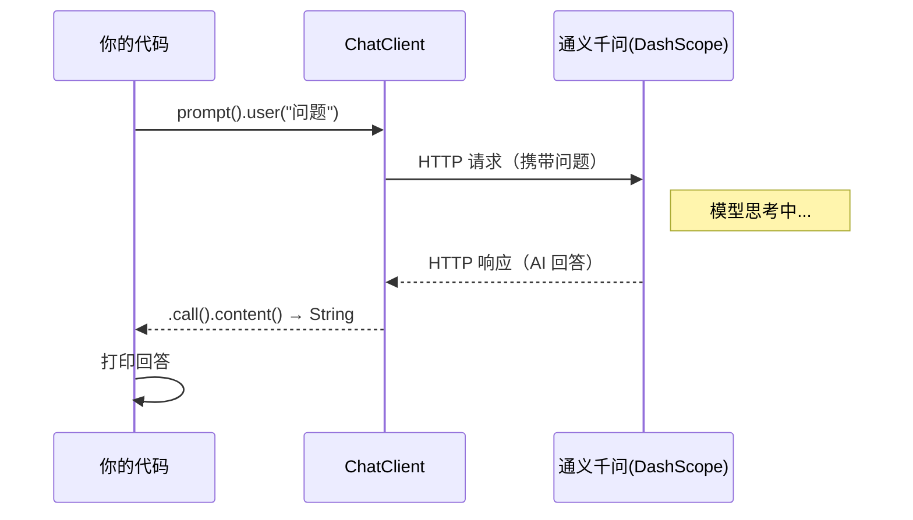

# 01 · 快速上手

> 本模块目标：理解 Spring AI Alibaba 最核心的几个概念，并跑通**人生第一个**通义千问调用。

## 一、要懂的核心概念（零基础必读）

| 概念 | 大白话解释 |
|---|---|
| **大模型 (LLM)** | 像通义千问(Qwen)、GPT 这样的 AI，给它文字、它回你文字。 |
| **DashScope (百炼)** | 阿里云的大模型服务平台，通义千问就跑在上面。 |
| **Spring AI** | Spring 官方 AI 框架，定义了 `ChatModel` / `ChatClient` 等**通用抽象**。 |
| **Spring AI Alibaba** | 构建在 Spring AI 之上的**阿里开源框架**：原生接入 DashScope，并额外提供 Graph 多智能体等能力。 |
| **ChatClient** | 与大模型对话的**高级客户端**，链式调用，最常用（本项目主角）。 |
| **Starter** | 一个依赖（`spring-ai-alibaba-starter-dashscope`），引入后自动配置好一切。 |

> 一句话关系：**Spring AI Alibaba = Spring AI 的 API + DashScope 的模型 + 阿里的 Graph/工具扩展**。
> 所以本项目里 `ChatClient`、`Advisor`、`@Tool` 等写法和隔壁 `spring-ai-learning` 完全一样，只是底层模型换成了通义千问。

## 二、调用原理流程图



## 三、关键代码（一行链式调用）

```java
String answer = chatClient
        .prompt()           // 开始一次提问
        .user(question)     // 用户问题
        .call()             // 同步调用（阻塞等完整结果）
        .content();         // 取回答文本
```

## 四、怎么运行

1. 在 `../config/spring-ai-alibaba-common.yml` 配好 **百炼(DashScope) 的 Key**（或设置环境变量 `AI_DASHSCOPE_API_KEY`）。
   - 申请地址：<https://bailian.console.aliyun.com/> → “API-KEY 管理”创建。
2. 在**本模块目录**下执行：

```bash
cd 01-quickstart
mvn spring-boot:run
```

3. 控制台应打印出通义千问对“什么是 Spring AI Alibaba”的回答。

## 五、预期输出（示例）

```
========== 模块01：第一个 Spring AI Alibaba 调用 ==========

【我问】请用一句话向 Java 初学者解释什么是 Spring AI Alibaba？

【AI 答】Spring AI Alibaba 是阿里巴巴基于 Spring AI 打造的框架，让 Java 开发者用熟悉的 Spring 方式调用通义千问并构建智能体……

========== 演示结束：恭喜，你已成功调用通义千问！ ==========
```

## 六、小结

- 引入一个 starter + 配一处 Key，就能用 `ChatClient` 调通义千问。
- `prompt() → user() → call() → content()` 是最基础的调用四件套。
- 下一站：[02-chat-model](../02-chat-model) 学习 ChatModel 底层、流式输出与 `DashScopeChatOptions` 运行时参数。
