# 02 · 对话模型（ChatModel 与 ChatClient）

> 本模块目标：分清 **ChatModel（底层引擎）** 与 **ChatClient（高级外壳）**，掌握**流式 / 非流式**两种返回方式，并学会用 `DashScopeChatOptions` 在**运行时**临时覆盖模型与参数。

## 一、核心概念

| 概念 | 大白话解释 |
|---|---|
| **ChatModel** | 底层模型接口，只有一个核心方法 `call(Prompt) → ChatResponse`，最贴近“发一次 HTTP 请求”。实现类是 `DashScopeChatModel`。 |
| **ChatClient** | 建立在 ChatModel 之上的高级客户端，链式 API，自动封装消息/挂 Advisor/结构化输出，**日常首选**。 |
| **非流式 `.call()`** | 等模型把答案**全部想完**，一次性返回完整 `String`。 |
| **流式 `.stream()`** | 模型**边想边吐字**，返回 `Flux<String>`（会陆续到达的一串文字片段），适合打字机式实时输出。 |
| **`DashScopeChatOptions`** | DashScope 专属“选项”类（阿里特有），可在每次调用时覆盖 `model` / `temperature` 等参数。 |

> 一句话：**ChatClient 是方便的外壳，ChatModel 是干活的引擎**；`ChatClient` 内部就是委托 `ChatModel` 去请求通义千问的。

## 二、流程图

```mermaid
flowchart TD
    A[你的代码] -->|prompt&#40;&#41;.user&#40;..&#41;| B[ChatClient 高级外壳]
    B -->|委托| C[ChatModel 底层引擎<br/>DashScopeChatModel]
    C -->|HTTP| D[通义千问 DashScope]
    D -->|完整结果| C
    C --> B
    B -->|.call&#40;&#41;.content&#40;&#41; 一次性 String| A
    B -->|.stream&#40;&#41;.content&#40;&#41; Flux&lt;String&gt; 逐段| A
```



## 三、关键代码

```java
// 非流式：等全部想完
String a = chatClient.prompt().user("问题").call().content();

// 流式：Flux<String> 逐段打印（打字机效果）
Flux<String> flux = chatClient.prompt().user("问题").stream().content();
flux.toStream().forEach(System.out::print);   // 也可 flux.blockLast() 等它结束

// 底层 ChatModel：最原始的一次请求-响应
ChatResponse resp = chatModel.call(new Prompt("问题"));
String text = resp.getResult().getOutput().getText();

// 运行时覆盖模型 / 温度（只对这一次调用生效）
var options = DashScopeChatOptions.builder()
        .withModel("qwen-max").withTemperature(0.9).build();
String b = chatClient.prompt().options(options).user("问题").call().content();
```

## 四、怎么运行

1. 确保已在 `../config/spring-ai-alibaba-common.yml` 配好百炼 Key（或环境变量 `AI_DASHSCOPE_API_KEY`）。
2. 在本模块目录执行：

```bash
cd 02-chat-model
mvn spring-boot:run
```

## 五、预期输出（示例）

```
========== 模块02：ChatModel 与 ChatClient ==========

---------- 演示1：非流式 .call().content() ----------
【我问】用一句话介绍你自己。
【AI 答（非流式）】我是通义千问，阿里巴巴研发的大语言模型……

---------- 演示2：流式 .stream().content() ----------
【我问】用三句话描述杭州西湖的美。
【AI 答（流式，逐段到达）】西湖如镜……（逐字出现）

---------- 演示3：底层 chatModel.call(Prompt) ----------
【我问】1 加 1 等于几？只回答数字。
【AI 答（底层）】2

---------- 演示4：DashScopeChatOptions 运行时覆盖参数 ----------
【AI 答（qwen-max）】1. 墨墨  2. 云糕  3. 三花大人
```

## 六、小结

- 记住两层：日常用 `ChatClient`，想看底层就 `chatModel.call(Prompt)`。
- 两种返回：`.call()` 一次性、`.stream()` 返回 `Flux<String>` 逐段。
- `DashScopeChatOptions.builder().withModel(..).withTemperature(..)` 可在运行时逐次覆盖参数。
- 下一站：[03-prompt](../03-prompt) 学习 System/User 角色与 `PromptTemplate` 提示词模板。
