# 03 · 提示词（Prompt）

> 本模块目标：掌握 **System / User 角色** 的区别，学会用 **`PromptTemplate` 占位符模板** 把提示词写得可复用、可参数化。

## 一、核心概念

| 概念 | 大白话解释 |
|---|---|
| **System 消息** | 设定 AI 的**身份 / 风格 / 规则**（“你是谁、要怎么答”）。同一问题换个 System，回答风格截然不同。 |
| **User 消息** | 用户真正问的**问题**（“我想问什么”）。 |
| **Assistant 消息** | AI 的**回答**，由模型产生，我们读取即可。 |
| **PromptTemplate** | 带占位符 `{name}` 的提示词**模板**，运行时用 `Map` 填充真实值，避免手工拼字符串。 |

> 一句话：**System 管“人设”，User 管“问题”，PromptTemplate 管“把提示词写成可填空的模板”。**

## 二、流程图

```mermaid
flowchart LR
    S[System 人设<br/>你是严谨的医生] --> P[组装成一次对话]
    U[User 问题<br/>怎么睡好觉] --> P
    T["PromptTemplate<br/>{name}/{role}/{festival}"] -->|render&#40;Map&#41;| U
    P -->|call&#40;&#41;.content&#40;&#41;| A[Assistant 回答]
```



## 三、关键代码

```java
// System + User 组合
String a = chatClient.prompt()
        .system("你是一位严谨专业的医生，只讲科学建议。")   // 人设/规则
        .user("怎么才能睡个好觉？")                          // 问题
        .call().content();

// PromptTemplate 占位符渲染
PromptTemplate t = new PromptTemplate("请给叫 {name} 的{role}写一句{festival}祝福语。");
String text = t.render(Map.of("name","小明","role","小学老师","festival","教师节"));
String r = chatClient.prompt().user(text).call().content();
```

## 四、怎么运行

```bash
cd 03-prompt
mvn spring-boot:run
```

（需先在 `../config/spring-ai-alibaba-common.yml` 配好百炼 Key。）

## 五、预期输出（示例）

```
---------- 演示1：System 角色决定回答风格 ----------
【人设A·严谨医生】1. 固定作息……2. 睡前避免咖啡因……
【人设B·俏皮诗人】愿你枕月而眠，梦里有星河作伴……

---------- 演示2：PromptTemplate 占位符模板渲染 ----------
【模板渲染后的最终提示词】请给一位叫 小明 的小学老师，写一句温暖的教师节祝福语，20 字以内。
【AI 生成的祝福语】小明老师，愿您桃李满园，节日快乐！
```

## 六、小结

- `system()` 设人设、`user()` 提问，二者组合决定“怎么答 + 答什么”。
- `PromptTemplate.render(Map)` 把 `{占位符}` 填成最终文本，提示词从此可复用可参数化。
- 下一站：[04-structured-output](../04-structured-output) 学习把回答直接转成 Java 对象 / List。
