# 04 · 结构化输出

> 本模块目标：不再自己解析文字，用一行 **`.entity(...)`** 让大模型的回答**直接变成 Java 对象 / List**。

## 一、核心概念

| 概念 | 大白话解释 |
|---|---|
| **结构化输出** | 让 AI 回答“落地成对象”，业务代码直接 `book.title()` 取字段，无需手工解析文字。 |
| **`.entity(Class)`** | 把回答转成**一个对象**，如 `.entity(Book.class)`。 |
| **`.entity(ParameterizedTypeReference)`** | 把回答转成**泛型集合**，如 `List<Book>`。 |
| **`record`** | Java 16+ 的不可变数据类，一行定义 DTO，自动生成构造器/getter/toString。 |
| **`ParameterizedTypeReference`** | Spring 用来“保住泛型信息”的技巧。因 Java 泛型运行时会擦除，`List<Book>` 会退化成 `List`，用它 + 匿名子类 `{}` 才能保留 `<List<Book>>`。 |

> 原理一句话：ChatClient 后台自动往提示词追加“请按此 JSON 格式回答”，模型返回 JSON 后再反序列化成你声明的类型。

## 二、流程图

```mermaid
flowchart LR
    A[你的问题] --> B[ChatClient]
    B -->|自动附加 JSON 格式说明| C[通义千问]
    C -->|返回 JSON| B
    B -->|.entity&#40;Book.class&#41;| D[Book 对象]
    B -->|.entity&#40;ParameterizedTypeReference&#41;| E["List&lt;Book&gt;"]
```



## 三、关键代码

```java
record Book(String title, String author, int year) {}

// 单个对象
Book book = chatClient.prompt()
        .user("推荐一本 Java 经典书，给出书名/作者/年份")
        .call().entity(Book.class);
System.out.println(book.title());

// 对象列表（注意结尾的匿名子类 {}）
List<Book> books = chatClient.prompt()
        .user("推荐 3 本编程入门书")
        .call().entity(new ParameterizedTypeReference<List<Book>>() {});
```

## 四、怎么运行

```bash
cd 04-structured-output
mvn spring-boot:run
```

## 五、预期输出（示例）

```
---------- 演示1：.entity(Book.class) ----------
【拿到 Java 对象】Book[title=Effective Java, author=Joshua Bloch, year=2018]
  书名 title  = Effective Java
  作者 author = Joshua Bloch
  年份 year   = 2018

---------- 演示2：.entity(List<Book>) ----------
【拿到 List<Book>，共 3 本】
  1. 《Head First Java》 - Kathy Sierra (2005)
  2. 《Java核心技术》 - Cay Horstmann (2021)
  3. 《Effective Java》 - Joshua Bloch (2018)
```

## 六、小结

- 把结尾的 `.content()` 换成 `.entity(...)`，回答即可直接变对象。
- 单对象用 `.entity(Book.class)`；泛型集合用 `.entity(new ParameterizedTypeReference<List<Book>>(){})`。
- 用 `record` 定义 DTO 最省事。
- 下一站：[05-multimodality](../05-multimodality) 学习图片 + 文字的多模态输入（qwen-vl-max）。
