# 05 · 多模态（图片 + 文字）

> 本模块目标：让 AI **看图说话**——同时输入一张图片和一句文字，用视觉模型 **qwen-vl-max** 理解图片内容。

## 一、核心概念

| 概念 | 大白话解释 |
|---|---|
| **多模态 (Multimodality)** | 输入不止文字，还能有图片/音频等。本模块做“图片 + 文字”。 |
| **qwen-vl-max** | DashScope 的**视觉语言模型**（vl = Vision-Language）。普通 `qwen-plus/max` 看不懂图，必须换成它。 |
| **Media 附件** | Spring AI 用 `Media` 表示图片等非文字内容，挂在 User 消息上。 |
| **`UrlResource`** | 把一个公开图片 **URL** 包装成 Spring 资源对象，作为图片来源。 |

> 关键提醒：**不换 qwen-vl-max，模型就看不懂图片**。本模块用 `DashScopeChatOptions` 在调用时临时切换。

## 二、流程图

```mermaid
flowchart TD
    T["文字：这张图里有什么？"] --> M[一条多模态 User 消息]
    I["图片：公开 URL<br/>UrlResource"] --> M
    M --> C["ChatClient<br/>options: qwen-vl-max"]
    C -->|call&#40;&#41;.content&#40;&#41;| R[AI 对画面的文字描述]
```



## 三、关键代码

```java
UrlResource image = new UrlResource("https://.../dog_and_girl.jpeg");

String answer = chatClient.prompt()
    // 1) 换成视觉模型
    .options(DashScopeChatOptions.builder().withModel("qwen-vl-max").build())
    // 2) 一条 User 消息同时带文字 + 图片
    .user(u -> u.text("这张图片里有什么？")
                .media(MimeTypeUtils.IMAGE_JPEG, image))
    .call().content();
```

## 四、怎么运行

```bash
cd 05-multimodality
mvn spring-boot:run
```

- 需先配好百炼 Key，且账号已开通 **qwen-vl-max**。
- 需要能访问示例图片 URL（默认用阿里云官方公开示例图）。

## 五、预期输出（示例）

```
【使用模型】qwen-vl-max（视觉模型，能看懂图片）
【图片地址】https://dashscope.oss-cn-beijing.aliyuncs.com/images/dog_and_girl.jpeg
【我问】这张图片里有什么？请用中文简要描述画面内容。

【AI 看图说话】画面中，一位女孩坐在海滩上，与一只戴着项圈的狗互动，两者伸手/爪相触，背景是夕阳下的海浪……
```

## 六、小结

- 多模态 = 换视觉模型 `qwen-vl-max` + 用 `.media(...)` 把图片挂到 User 消息上。
- 图片来源可用 `UrlResource(公开URL)`，也可用本地文件资源。
- 代码对 URL 异常与调用失败做了兜底，未配 Key 时也不会崩。
- 下一站：[06-chat-memory](../06-chat-memory) 学习对话记忆，让 AI 记住上下文。
