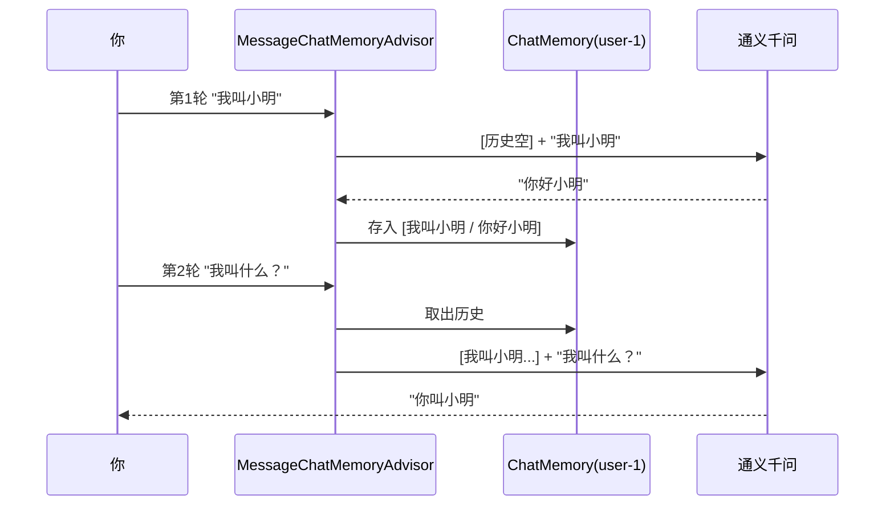

# 06 · 对话记忆

> 本模块目标：给“天生无记忆”的大模型加上**多轮记忆**，让它记住上一句说过的话，并理解不同会话之间**记忆是隔离的**。

## 一、核心概念

| 概念 | 大白话解释 |
|---|---|
| **模型无记忆** | 每次 API 调用彼此独立，模型不会自动记得你上一句。 |
| **`ChatMemory`** | 存历史消息的容器。`MessageWindowChatMemory` 是**滑动窗口**，只保留最近 N 条。 |
| **`MessageChatMemoryAdvisor`** | 记忆“顾问/拦截器”：请求前自动带上历史，请求后把新问答存回。挂到 ChatClient 即自动生效。 |
| **`CONVERSATION_ID`** | 会话 ID。不同用户/会话用不同 ID 隔离各自记忆，互不串台。 |

> 原理一句话：**模型本身没记忆，是 Advisor 每次把“历史消息”一并带上，制造出“记得”的效果。**

## 二、流程图



## 三、关键代码

```java
// 1) 滑动窗口记忆：最多留最近 10 条
ChatMemory memory = MessageWindowChatMemory.builder().maxMessages(10).build();

// 2) 把记忆顾问设为默认 Advisor
ChatClient client = builder
        .defaultAdvisors(MessageChatMemoryAdvisor.builder(memory).build())
        .build();

// 3) 调用时用会话 ID 区分不同会话
client.prompt().user("我叫小明")
      .advisors(a -> a.param(ChatMemory.CONVERSATION_ID, "user-1"))
      .call().content();
```

## 四、怎么运行

```bash
cd 06-chat-memory
mvn spring-boot:run
```

## 五、预期输出（示例）

```
---------- 第1轮：自我介绍 ----------
【我说】你好，我叫小明，今年 18 岁。
【AI 答】你好小明！很高兴认识你。

---------- 第2轮：验证记忆 ----------
【我问】请问我叫什么名字？今年多大？
【AI 答】你叫小明，今年 18 岁。   ← 记住了！

---------- 对比：换会话 ID = user-2 ----------
【AI 答（user-2）】抱歉，我还不知道你的名字。   ← 记忆隔离
```

## 六、小结

- 记忆 = `MessageWindowChatMemory`（存） + `MessageChatMemoryAdvisor`（自动带上/存回）。
- 用 `ChatMemory.CONVERSATION_ID` 区分会话，实现多用户记忆隔离。
- 下一站：[07-advisors](../07-advisors) 深入 Advisor 顾问/拦截器机制本身。
