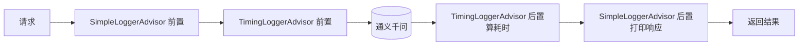

# 07 · Advisor 顾问 / 拦截器

> 本模块目标：理解 Spring AI 的 **Advisor（拦截器 / 中间件）** 机制，学会用内置 `SimpleLoggerAdvisor`，并**亲手写一个**自定义 `CallAdvisor` 统计调用耗时。

## 一、核心概念

| 概念 | 大白话解释 |
|---|---|
| **Advisor** | 包在“真正调模型”外面的**拦截器**，可在请求前/响应后插入逻辑（日志、耗时、记忆、RAG…）。 |
| **洋葱模型** | 多个 Advisor 层层包裹，请求由外向内、响应由内向外穿过每一层。 |
| **`SimpleLoggerAdvisor`** | 内置日志顾问，按 **DEBUG** 级别打印每次请求/响应全文。 |
| **`CallAdvisor`** | 自定义**非流式**顾问要实现的接口，核心方法 `adviseCall(request, chain)`。 |
| **`chain.nextCall(request)`** | “放行”给链上下一环；在它前后就是你的前置/后置逻辑。 |

> 模块06 的 `MessageChatMemoryAdvisor` 正是一个 Advisor。Advisor 是 Spring AI 扩展能力的统一入口。

## 二、流程图



## 三、关键代码

**挂载 Advisor（内置 + 自定义）：**

```java
ChatClient client = builder
    .defaultAdvisors(new SimpleLoggerAdvisor(), new TimingLoggerAdvisor())
    .build();
```

**自定义一个 `CallAdvisor`（统计耗时）：**

```java
public class TimingLoggerAdvisor implements CallAdvisor {
    @Override
    public ChatClientResponse adviseCall(ChatClientRequest request, CallAdvisorChain chain) {
        long start = System.currentTimeMillis();                 // 前置
        ChatClientResponse response = chain.nextCall(request);   // 放行给下一环/模型
        System.out.println("耗时 " + (System.currentTimeMillis() - start) + " ms"); // 后置
        return response;
    }
    @Override public String getName() { return "TimingLoggerAdvisor"; }
    @Override public int getOrder() { return 0; }   // 越小越靠外层
}
```

> 说明：`CallAdvisor` 只拦截**非流式** `.call()`。要拦截**流式** `.stream()`，实现 `StreamAdvisor`（方法 `adviseStream`，返回 `Flux`），思路完全一致。

## 四、怎么运行

```bash
cd 07-advisors
mvn spring-boot:run
```

`application.yml` 已把 `org.springframework.ai.chat.client.advisor` 日志级别设为 `DEBUG`，以便看到 `SimpleLoggerAdvisor` 的请求/响应打印。

## 五、预期输出（示例）

```
已挂载的 Advisor：
  1) SimpleLoggerAdvisor（内置）
  2) TimingLoggerAdvisor（自定义）

【我问】用一句话说明什么是"拦截器"。
  [⏱ TimingAdvisor] 请求发出 @ 14:22:01.123
  [⏱ TimingAdvisor] 收到响应 @ 14:22:02.456，本次调用耗时 1333 ms
（其间 SimpleLoggerAdvisor 以 DEBUG 打印了完整请求/响应）

【AI 答】拦截器是在主流程前后插入统一处理逻辑的一层"关卡"。
```

## 六、小结

- Advisor = 洋葱式拦截器，`chain.nextCall()` 前后即前置/后置。
- 内置 `SimpleLoggerAdvisor` 打印请求/响应；自定义实现 `CallAdvisor` 即可插入任意逻辑。
- 下一站：[08-tool-calling](../08-tool-calling) 学习工具调用，让模型自动调用你的 Java 方法。
