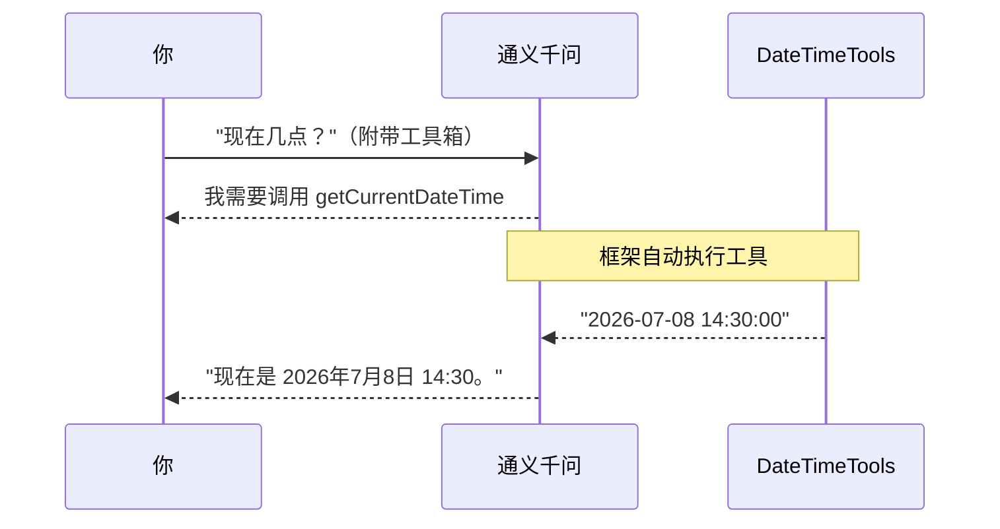

# 08 · 工具调用（Tool / Function Calling）

> 本模块目标：给模型配上“工具箱”，让它在需要时**自动决定**调用你的 Java 方法（如查当前时间、做计算），再用工具结果作答。

## 一、核心概念

| 概念 | 大白话解释 |
|---|---|
| **工具调用 (Tool Calling)** | 又叫 Function Calling。把 Java 方法标记成“工具”，模型需要时自动调用它。 |
| **`@Tool(description=...)`** | 把一个方法声明为工具。`description` 极其重要——模型靠它判断“何时该调这个工具”。 |
| **`@ToolParam(description=...)`** | 说明工具方法的每个参数含义，模型据此从问题中解析并填参。 |
| **`.tools(new XxxTools())`** | 把工具箱交给模型。调不调、调哪个、传什么参数，全由模型自己决定。 |

> 关键：**你不手动调用工具**。你只提供工具，模型自主决策，框架自动执行并把结果回填给模型。

## 二、流程图



## 三、关键代码

**定义工具类：**

```java
public class DateTimeTools {
    @Tool(description = "获取用户所在时区的当前日期和时间")
    public String getCurrentDateTime() {
        return LocalDateTime.now().format(...);
    }

    @Tool(description = "根据一个人的年龄，推算其出生年份")
    public int birthYearOf(@ToolParam(description = "此人的年龄（整数岁）") int age) {
        return LocalDate.now().getYear() - age;
    }
}
```

**把工具交给模型：**

```java
String answer = chatClient.prompt()
        .user("现在几点了？")
        .tools(new DateTimeTools())   // 模型自动决定是否调用
        .call().content();
```

## 四、怎么运行

```bash
cd 08-tool-calling
mvn spring-boot:run
```

## 五、预期输出（示例）

```
---------- 演示1：问"现在几点" ----------
【我问】现在几点了？请告诉我完整的日期和时间。
  [🔧 工具被调用] getCurrentDateTime() -> 2026-07-08 14:30:00
【AI 答】现在是 2026 年 7 月 8 日 14:30:00。

---------- 演示2：带参数的工具 ----------
【我问】我今年 18 岁，请问我大概是哪一年出生的？
  [🔧 工具被调用] birthYearOf(age=18) -> 2008
【AI 答】你大约出生于 2008 年。
```

（控制台里 `[🔧 工具被调用]` 那几行，证明模型确实自动调用了你的 Java 方法。）

## 六、小结

- 工具 = 普通方法 + `@Tool`（参数加 `@ToolParam`），用 `.tools(...)` 交给模型。
- 调用时机与参数由模型自主决策，框架自动执行并回填结果。
- 这是构建“智能体(Agent)”的基石——后续 Graph / ReactAgent 模块会大量用到。
- 下一站：[09-embedding](../09-embedding) 学习文本向量化，进入向量与 RAG 的世界。
