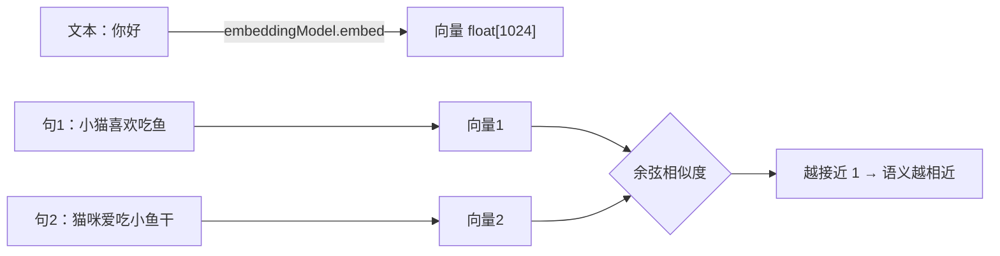

# 09 · 文本向量化 Embedding

> 本模块目标：理解**把文字变成一串数字（向量）**是怎么回事，并亲手用“余弦相似度”比较两句话的语义远近。这是向量库(10)、RAG(11)、文档 ETL(12) 的地基。

## 一、要懂的核心概念

| 概念 | 大白话解释 |
|---|---|
| **向量 (Vector)** | 一组小数，如 `[0.12, -0.03, 0.88, ...]`。 |
| **Embedding (向量化)** | 把「文本」变成「向量」的过程。含义相近的文本，向量也相近。 |
| **维度 (Dimension)** | 向量里有多少个数字。`text-embedding-v3` 输出 **1024 维**。 |
| **余弦相似度** | 比较两个向量“方向有多接近”，取值 -1~1，**越接近 1 越相近**。 |
| **EmbeddingModel** | Spring AI 的向量化统一接口，底层由 DashScope `text-embedding-v3` 实现。 |

> 一句话：**Embedding 把“语义”变成了“坐标”**，于是“找意思相近的内容”就变成了“找坐标相近的点”，计算机就能算了。

## 二、原理流程图



## 三、关键代码

```java
// 1) 文本 → 向量
float[] vector = embeddingModel.embed("你好");
System.out.println(vector.length);        // 1024

// 2) 余弦相似度 = (A·B) / (|A|×|B|)，越接近 1 越相近
double sim = cosineSimilarity(embeddingModel.embed(s1), embeddingModel.embed(s2));
```

## 四、怎么运行

1. 在 `../config/spring-ai-alibaba-common.yml` 配好 **百炼(DashScope) 的 Key**（或设环境变量 `AI_DASHSCOPE_API_KEY`）。
2. 在**本模块目录**下执行：

```bash
cd 09-embedding
mvn spring-boot:run
```

## 五、预期输出（示例）

```
========== 模块09：文本向量化 Embedding ==========

【1) 文本变向量】
  原文：你好
  向量维度(dimensions)：1024（text-embedding-v3 应为 1024）
  前 8 维：[0.013, -0.72, 0.33, ...] ...(后面还有 1016 维)

【2) 语义相似度对比（余弦相似度，越接近 1 越相近）】
  相似度(句1, 句2 都在讲猫)   = 0.82
  相似度(句1, 句3 猫 vs 天气) = 0.31
```

## 六、小结

- `embeddingModel.embed(text)` 一行把文本变成 1024 维 `float[]`。
- 语义相近 → 向量相近 → 余弦相似度高，这就是“语义检索”的底层原理。
- 下一站：[10-vector-store](../10-vector-store) 把一堆文档向量化后存进**内存向量库**，做“按意思检索”。
