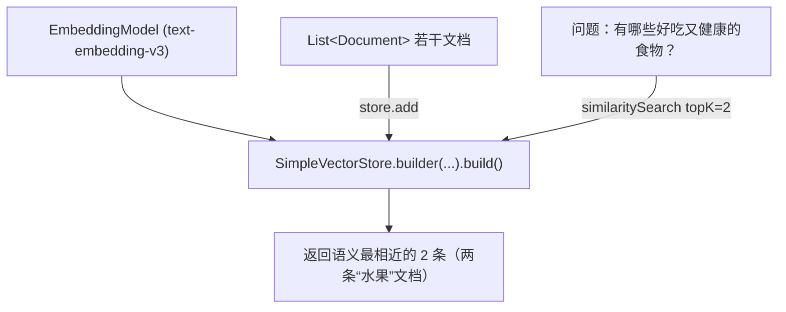

# 10 · 向量数据库（内存版 SimpleVectorStore）

> 本模块目标：把一批文档向量化后**存进内存向量库**，再用一个问题**按语义相近**把最相关的几条捞出来。这是 RAG(11) 的“检索”环节。

## 一、要懂的核心概念

| 概念 | 大白话解释 |
|---|---|
| **Document** | 向量库里的一条数据 = 一段文本 + 可选元数据(metadata)。 |
| **VectorStore** | 存 Document、并支持“相似度检索”的组件。 |
| **SimpleVectorStore** | Spring AI 自带的**内存版**向量库，退出即清空，最适合学习。 |
| **similaritySearch** | 给一句 query，返回语义最相近的前 K 条 Document。 |
| **topK** | 检索时“只要最相近的前几条”。 |

> 生产环境可把 `SimpleVectorStore` 换成 Redis / PGVector / Milvus 等持久化向量库，**上层检索代码几乎不用改**——这就是 Spring AI 统一抽象的价值。

## 二、原理流程图



## 三、关键代码

```java
// 1) 用 EmbeddingModel 建内存向量库
SimpleVectorStore store = SimpleVectorStore.builder(embeddingModel).build();

// 2) 写入文档（内部自动向量化）
store.add(List.of(new Document("苹果……"), new Document("Java……"), ...));

// 3) 按语义检索最相近的前 2 条
List<Document> hits = store.similaritySearch(
        SearchRequest.builder().query("有哪些好吃又健康的食物？").topK(2).build());
```

## 四、怎么运行

1. 配好 **百炼(DashScope) 的 Key**（见 09 或共享配置说明）。
2. 在本模块目录执行：

```bash
cd 10-vector-store
mvn spring-boot:run
```

## 五、预期输出（示例）

```
========== 模块10：内存向量库 SimpleVectorStore ==========

【2) 已写入 5 条文档（水果 2 条、编程语言 2 条、名胜 1 条）】

【3) 检索】问题：有哪些好吃又健康的食物？
  向量库返回语义最相近的 2 条：
    [1] (相似度 0.61) 苹果是一种常见的水果，富含维生素，口感清脆香甜。
    [2] (相似度 0.58) 香蕉含有丰富的钾元素，是运动后补充能量的好选择。
```

## 六、小结

- `SimpleVectorStore.builder(embeddingModel).build()` 一行建库，`add` 存、`similaritySearch` 取。
- 检索是**按语义**而非关键词，所以问题不含“苹果”也能命中水果文档。
- 下一站：[11-rag](../11-rag) 把“检索到的内容”喂给大模型，让它**基于你的私有知识**回答问题。
