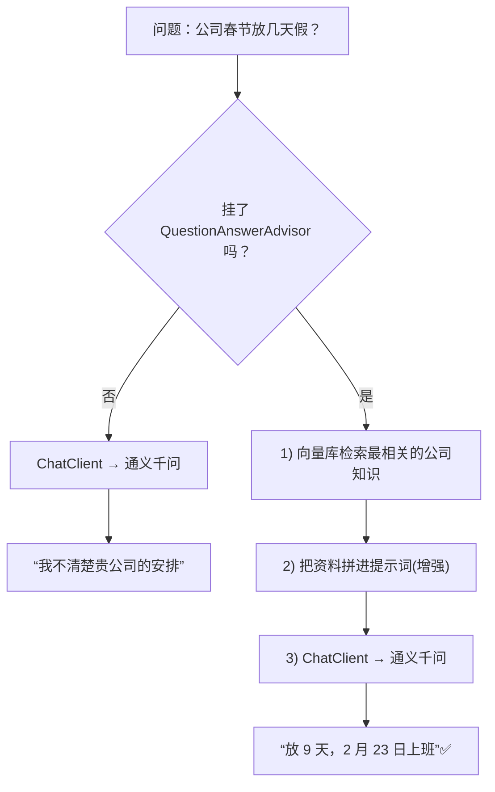

# 11 · 检索增强生成 RAG

> 本模块目标：让大模型**基于你的私有知识库回答问题**。做一个对比实验：同一个问题，不挂知识库时 AI 答不上来，挂上 `QuestionAnswerAdvisor` 后就能答对。

## 一、要懂的核心概念

| 概念 | 大白话解释 |
|---|---|
| **RAG** | Retrieval(检索) + Augmented(增强) + Generation(生成)。先查资料，再带着资料回答。 |
| **知识库** | 存放私有资料的向量库（本模块用 `SimpleVectorStore`）。 |
| **QuestionAnswerAdvisor** | Spring AI 内置的 RAG 顾问：提问前自动“检索向量库 + 把结果拼进提示词”。 |
| **为什么需要 RAG** | 大模型只学过公开知识，不知道你公司的放假/报销等**内部信息**。 |

> RAG 的价值：**不用重新训练模型**，只要把资料放进向量库，模型就能“懂”你的专属知识；资料更新了，检索结果也随之更新。

## 二、原理流程图



## 三、关键代码

```java
// 1) 建知识库并存入“公司内部知识”
VectorStore kb = SimpleVectorStore.builder(embeddingModel).build();
kb.add(List.of(new Document("【放假安排】……9 天……2 月 23 日上班"), ...));

// 2) 创建 RAG 顾问
QuestionAnswerAdvisor qa = QuestionAnswerAdvisor.builder(kb).build();

// 3) 提问时挂上顾问：自动“检索 + 增强 + 生成”
String answer = chatClient.prompt()
        .advisors(qa)
        .user("公司 2026 年春节放几天假？")
        .call().content();
```

## 四、怎么运行

1. 配好 **百炼(DashScope) 的 Key**。
2. 在本模块目录执行：

```bash
cd 11-rag
mvn spring-boot:run
```

## 五、预期输出（示例）

```
========== 模块11：检索增强生成 RAG ==========

【2) 不挂知识库直接问】问题：公司 2026 年春节放几天假？几号开始上班？
  AI 答：抱歉，我无法获知贵公司的具体放假安排……

【3) 挂上 RAG 顾问再问同一问题】问题：公司 2026 年春节放几天假？几号开始上班？
  AI 答：根据公司安排，2026 年春节放假 9 天（2 月 14 日至 22 日），2 月 23 日正常上班。
```

## 六、小结

- RAG = 先检索私有知识、再让模型带着资料回答，无需重训模型。
- `QuestionAnswerAdvisor.builder(vectorStore).build()` 一行接入，挂到 `ChatClient` 即可。
- 下一站：[12-document-etl](../12-document-etl) 学习如何把**真实文档文件**读取→切分→批量入库，做成一条 ETL 管道。
