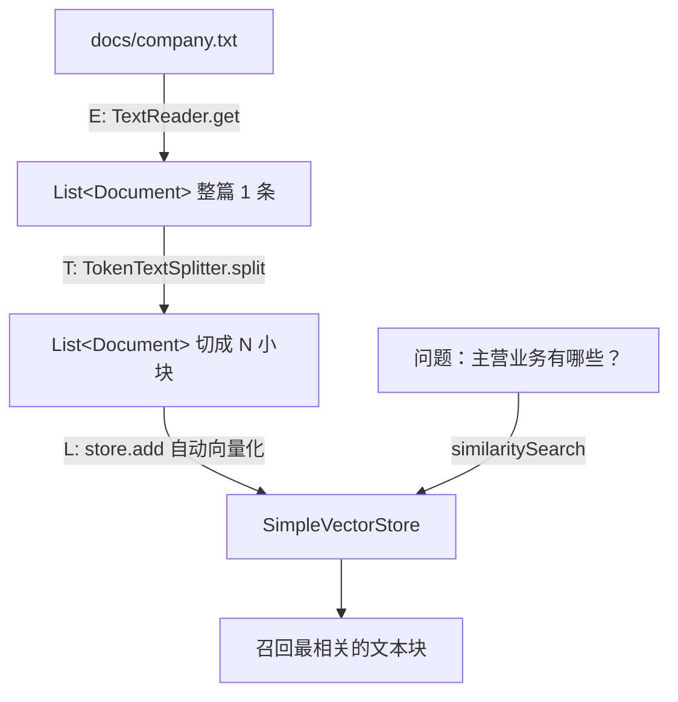

# 12 · 文档 ETL 管道

> 本模块目标：把一个真实的文本文件 `company.txt`，经过**读取 → 切分 → 入库**三步，自动变成可检索的知识块。这是把“文件”接入 RAG 的标准流水线。

## 一、要懂的核心概念

| 概念 | 大白话解释 |
|---|---|
| **ETL** | Extract(读取) + Transform(转换/切分) + Load(入库)，数据处理的经典三步。 |
| **TextReader** | 从 classpath 资源等数据源把文本读出来，返回 `List<Document>`。 |
| **TokenTextSplitter** | 按 token 数把长文档切成一小块一小块。 |
| **为什么要切分** | ① 模型单次处理长度有限；② 小块检索更精准，只召回相关那一段。 |
| **Load 入库** | 把每个块向量化后写进 `VectorStore`，供后续检索/RAG 使用。 |

## 二、原理流程图



## 三、关键代码

```java
// E) 读取：classpath 资源 → Document
List<Document> raw = new TextReader(companyDoc).get();

// T) 切分：长文 → 多个小块（chunkSize 调小以便演示切出多块）
List<Document> chunks = new TokenTextSplitter(60, 30, 5, 1000, true).split(raw);

// L) 入库：每块自动向量化写入
SimpleVectorStore store = SimpleVectorStore.builder(embeddingModel).build();
store.add(chunks);
```

`@Value("classpath:docs/company.txt") Resource companyDoc;` 负责把资源文件注入进来。

## 四、怎么运行

1. 配好 **百炼(DashScope) 的 Key**。
2. 在本模块目录执行：

```bash
cd 12-document-etl
mvn spring-boot:run
```

## 五、预期输出（示例）

```
========== 模块12：文档 ETL 管道（读取→切分→入库→检索）==========

【E) 读取 Extract】
  从 docs/company.txt 读出 1 个原始 Document（通常是整篇 1 条）。

【T) 切分 Transform】
  切分后共得到 6 个文本块（chunk）。逐块预览：
    块[1]（约 58 字）：星辰科技有限公司简介星辰科技成立于二〇一五年...
    ...

【L) 入库 Load】已把 6 个块写入 SimpleVectorStore（自动向量化）。

【验证检索】问题：星辰科技有哪些主营业务？
    命中[1]：公司主营业务分为三大板块。第一是智能客服平台...
```

> 实际切出的块数与文档内容、`chunkSize` 有关，数字仅供参考。

## 六、小结

- ETL 三步：`TextReader`(读) → `TokenTextSplitter`(切) → `VectorStore.add`(存)。
- 把 `TextReader` 换成 PDF/Word/Markdown 读取器，就能处理各种真实文档。
- 下一站：[13-image-model](../13-image-model) 从“文本”世界迈入“多模态”，用通义万相**文生图**。
