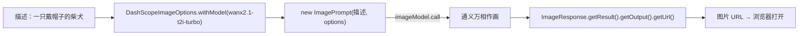

# 13 · 文生图（通义万相）

> 本模块目标：给一句文字描述，让阿里**通义万相(wanx)** 画出一张图，并取回图片 URL。第一次接触**多模态**（文字 → 图片）。

## 一、要懂的核心概念

| 概念 | 大白话解释 |
|---|---|
| **文生图 (Text-to-Image)** | 输入一段文字描述，输出一张图片。 |
| **通义万相 (wanx)** | 阿里的文生图大模型，本项目用 `wanx2.1-t2i-turbo`（速度快）。 |
| **ImageModel** | Spring AI 的图像生成统一接口，底层由 `DashScopeImageModel` 实现。 |
| **DashScopeImageOptions** | DashScope 专属选项，用来指定万相模型、尺寸等。 |
| **返回形式** | 万相返回的是图片 **URL**（不是 base64），复制到浏览器即可查看/下载。 |

> ⚠️ **使用前提**：文生图是需要**单独开通**的能力。请到[百炼控制台](https://bailian.console.aliyun.com/)确认已开通**通义万相 wanx** 的调用权限，且账户有额度，否则会报权限/欠费错误。

## 二、原理流程图



## 三、关键代码

```java
ImageResponse response = imageModel.call(new ImagePrompt(
        "一只戴帽子的柴犬，卡通风格",
        DashScopeImageOptions.builder().withModel("wanx2.1-t2i-turbo").build()));

if (response != null && response.getResult() != null
        && response.getResult().getOutput() != null) {
    String url = response.getResult().getOutput().getUrl();   // 图片 URL
    System.out.println(url);
}
```

> 代码对 `response` 做了判空兜底：即使没配 Key / 没权限，也不会以异常堆栈崩溃。

## 四、怎么运行

1. 配好 **百炼(DashScope) 的 Key**，并确认已**开通通义万相权限**。
2. 在本模块目录执行：

```bash
cd 13-image-model
mvn spring-boot:run
```

## 五、预期输出（示例）

```
========== 模块13：文生图（通义万相 wanx）==========

【我说】请画：一只戴帽子的柴犬，卡通风格，阳光明媚的草地背景
（正在请求通义万相作画，可能需要几秒到十几秒，请稍候……）

【AI 画好了】图片 URL（复制到浏览器即可查看/下载）：
  https://dashscope-result-xxx.oss-cn-beijing.aliyuncs.com/xxxx.png
```

## 六、小结

- `imageModel.call(new ImagePrompt(描述, 万相选项))` 一行完成文生图。
- 万相返回**图片 URL**（有时效，请及时下载）；调用前需在百炼开通 wanx 权限。
- 下一站：[14-audio-model](../14-audio-model) 继续多模态之旅，玩转**语音合成(TTS)与语音识别(ASR)**。
