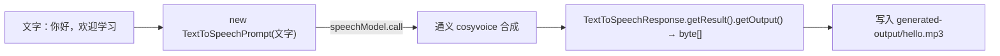

# 14 · 语音（TTS 合成 / ASR 识别）

> 本模块目标：动手完成 **TTS 文字转语音**——把“你好，欢迎学习”合成为 `hello.mp3`；并了解反方向的 **ASR 语音转文字**用法。

## 一、要懂的核心概念

| 概念 | 大白话解释 |
|---|---|
| **TTS (文字转语音)** | Text-To-Speech，把文字读成音频。本模块**动手演示**。 |
| **ASR (语音转文字)** | Automatic Speech Recognition，把音频听写成文字。见下方“进阶”。 |
| **DashScopeAudioSpeechModel** | DashScope 的 TTS 实现，实现了 Spring AI 的 `TextToSpeechModel` 接口，starter 自动配置成 Bean。 |
| **cosyvoice-v1 / longxiaochun** | 本项目用的 TTS 模型与音色（共享配置里已设好）。 |
| **合成结果** | 一段音频字节 `byte[]`，写成 `generated-output/hello.mp3`。 |

> ⚠️ **使用前提**：语音能力需**单独开通**。请到[百炼控制台](https://bailian.console.aliyun.com/)确认已开通对应语音模型（`cosyvoice` / `paraformer`）权限且账户有额度。

## 二、原理流程图



## 三、关键代码（TTS）

```java
// 注入 DashScopeAudioSpeechModel（starter 自动配置）
TextToSpeechResponse response = speechModel.call(new TextToSpeechPrompt("你好，欢迎学习"));

byte[] audio = (response != null && response.getResult() != null)
        ? response.getResult().getOutput() : null;   // 判空兜底

if (audio != null && audio.length > 0) {
    Files.createDirectories(Paths.get("generated-output"));
    Files.write(Paths.get("generated-output/hello.mp3"), audio);
}
```

## 四、关于输出目录 `generated-output/`

- 合成的音频写到**本模块目录下的 `generated-output/hello.mp3`**。
- 该目录已被项目根 `.gitignore` 的 `**/generated-output/` 规则忽略，不会提交进仓库。
- 运行后用系统播放器打开这个 mp3 即可听到语音。

## 五、进阶：ASR 语音转文字（代码片段）

ASR 把一段音频听写成文字。DashScope 提供 `DashScopeAudioTranscriptionModel`（模型 `paraformer`），
注入后即可调用。不同版本 API 略有差异，参考写法如下：

```java
// 注入 ASR 模型（starter 自动配置）
private final DashScopeAudioTranscriptionModel transcriptionModel;

// 用 Spring AI 通用的转写接口：传入音频资源，拿回识别文本
AudioTranscriptionPrompt prompt =
        new AudioTranscriptionPrompt(new ClassPathResource("audio/sample.wav"));
AudioTranscriptionResponse resp = transcriptionModel.call(prompt);
String text = resp.getResult().getOutput();   // 识别出的文字
System.out.println("听写结果：" + text);
```

> 说明：本模块的**可运行代码只演示 TTS**，以保证在不同 Spring AI Alibaba 版本下都能稳定编译；
> ASR 的确切类名/方法请以你所用版本的 `DashScopeAudioTranscriptionModel` 为准。

## 六、怎么运行

1. 配好 **百炼(DashScope) 的 Key**，并确认已**开通语音合成权限**。
2. 在本模块目录执行：

```bash
cd 14-audio-model
mvn spring-boot:run
```

## 七、预期输出（示例）

```
========== 模块14：语音合成 TTS（文字转语音）==========

【要合成的文字】你好，欢迎学习 Spring AI Alibaba
（正在请求通义语音合成，请稍候……）

【合成成功】音频已保存：
  文件：/.../14-audio-model/generated-output/hello.mp3
  大小：45312 字节
  用系统播放器打开这个 mp3 就能听到语音了。
```

## 八、小结

- TTS：`speechModel.call(new TextToSpeechPrompt(文字))` → `getResult().getOutput()` 得到 `byte[]` → 写成 mp3。
- ASR 是其逆过程，用 `DashScopeAudioTranscriptionModel`（见上方片段）。
- 语音属于需单独开通的能力，调用前请确认权限与额度。
- 下一站：[15-mcp](../15-mcp) 进入工程化篇，学习**模型上下文协议 MCP**，让智能体调用外部工具/服务。
