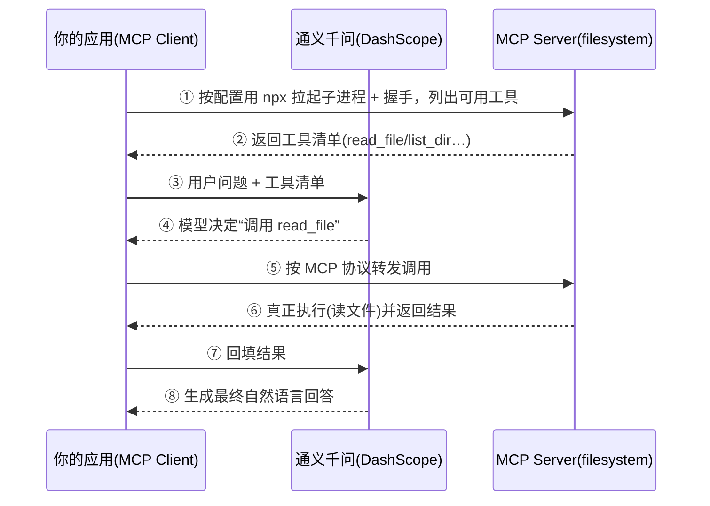

# 15 · 模型上下文协议 MCP

> 本模块目标：理解 **MCP（Model Context Protocol）** 是什么，并学会把一个 **MCP Server** 提供的外部工具接入 `ChatClient`，让 AI 能像用本地 `@Tool` 一样调用它们。

## 一、要懂的核心概念

| 概念 | 大白话解释 |
|---|---|
| **MCP** | Model Context Protocol，模型上下文协议。一套**开放标准**，规定 AI 应用与“工具/数据服务”之间怎么通信。 |
| **MCP Server** | 把某种能力（读写文件、查数据库、调 GitHub…）按 MCP 协议封装成的**服务端**。例如官方 `filesystem` server。 |
| **MCP Client** | 你的 AI 应用，按协议连接 Server、发现并调用其工具。本模块就是一个 Client。 |
| **stdio 传输** | 把 Server 当作**本地子进程**（如 `npx` 拉起）启动，用标准输入输出通信。适合本地工具。 |
| **SSE / http 传输** | 连接一个**远程 HTTP** 服务。适合线上共享的工具。 |
| **ToolCallbackProvider** | MCP Starter 自动生成的“工具提供者”，把从各 Server 发现的工具封装成 Spring AI 的 `ToolCallback`。 |

> 一句话：**MCP = 给 AI 接“外部工具”的统一插座**。工具方一次封装成 Server，任何模型/框架都能即插即用，不用为每个模型重复适配。

## 二、工作流程图



## 三、关键代码

```java
// 可选注入：没配 MCP Server 时取不到，getIfAvailable() 返回 null（保证零配置也能跑）
private final ObjectProvider<ToolCallbackProvider> mcpToolProvider;

ToolCallbackProvider provider = mcpToolProvider.getIfAvailable();
if (provider == null || provider.getToolCallbacks().length == 0) {
    // 未配置 MCP Server，跳过工具增强
} else {
    String answer = chatClient.prompt()
            .user("列出允许目录下的文件并总结")
            .toolCallbacks(provider)   // ★ 把 MCP 工具挂到本次对话
            .call()
            .content();
}
```

## 四、怎么运行

### 1）零配置直接跑（默认）
不接任何 MCP Server 也能运行，会打印“未检测到 MCP Server，跳过”，并做一次普通对话解释 MCP：

```bash
cd 15-mcp
mvn spring-boot:run
```

### 2）真正接入官方 filesystem Server（进阶）
前提：本机安装 **Node.js**（能运行 `npx`）。

1. 打开 `src/main/resources/application.yml`，解开被注释的 `spring.ai.mcp.client.stdio` 整段；
2. 把 `<你的目录>` 改成一个真实目录（AI 只能访问这个目录，安全沙箱）；
3. 重新 `mvn spring-boot:run`。启动时 Spring Boot 会用 `npx -y @modelcontextprotocol/server-filesystem <你的目录>` 拉起 Server，
   自动发现 `read_file`/`list_directory` 等工具并注入 `ChatClient`；
4. 这时 AI 就能真的去列目录、读文件并总结内容了。

> 配置要点回顾：`command: npx` + `args: [-y, @modelcontextprotocol/server-filesystem, <你的目录>]`。

## 五、预期输出（零配置默认情况）

```
========== 模块15：MCP（模型上下文协议）客户端 ==========

【提示】当前未检测到已配置的 MCP Server（工具数量=0），跳过“工具增强”演示。
        ...
【降级演示】先做一次普通对话，请 AI 解释 MCP：
【AI 答】MCP 是一套开放标准，让大模型能以统一方式连接外部工具和数据……

========== 演示结束：MCP = 给 AI 接“外部工具”的统一插座 ==========
```

接入 filesystem Server 后，最后一段会变成 AI 借助 MCP 工具列出目录并总结文件内容。

## 六、小结

- MCP 用“统一插座”思路解决工具适配碎片化：Server 一次封装，任何模型/应用即插即用。
- Spring AI 的 `spring-ai-starter-mcp-client` 会按 `spring.ai.mcp.client.*` 自动连接 Server 并生成 `ToolCallbackProvider`。
- 用 `chatClient.prompt().toolCallbacks(provider)` 就能让模型自动调用 MCP 工具。
- 下一站：[16-observability](../16-observability) 学习给 AI 调用加“可观测性”（日志 / 指标 / 链路追踪）。
