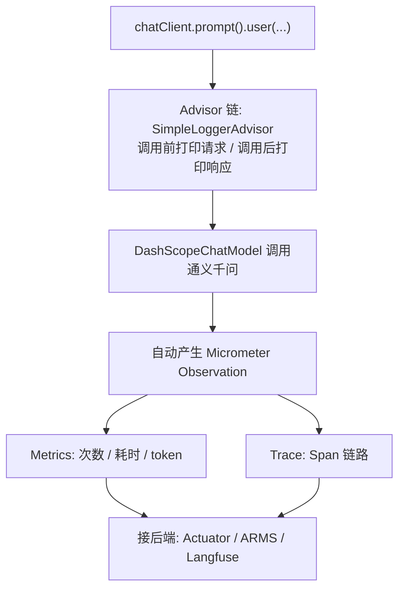

# 16 · 可观测性 Observability

> 本模块目标：给“AI 调用”装上仪表盘。理解**可观测性三支柱（日志 / 指标 / 链路）**，用内置 `SimpleLoggerAdvisor` 观察请求响应，并了解 Spring AI 如何自动产生指标与链路数据、如何对接阿里云 ARMS / Langfuse。

## 一、要懂的核心概念

| 概念 | 大白话解释 |
|---|---|
| **日志 Logs** | 一条条文本记录“发生了什么”。这里用 `SimpleLoggerAdvisor` 打印每次请求/响应。 |
| **指标 Metrics** | 可聚合的数字：调用次数、耗时分布、token 用量。由 **Micrometer** 采集。 |
| **链路 Traces / Span** | 把一次请求拆成若干环节(Span)，看清调用链与耗时瓶颈。 |
| **Observation** | Micrometer 的统一观测点。Spring AI 调用会**自动产生**它，既能转 metrics 又能转 trace。 |
| **Actuator** | Spring Boot 生产级监控端点，引入后带来 `ObservationRegistry` 并暴露 `/actuator/*`。 |
| **SimpleLoggerAdvisor** | Spring AI 内置的“日志顾问”，挂到 ChatClient 即可记录每次请求/响应。 |

> 一句话：**Spring AI 的可观测性大多是“自动”的**——你只要把类路径上的 observation “接出去”到某个后端（日志/ARMS/Langfuse），业务代码几乎不用改。

## 二、数据流程图



## 三、关键代码

```java
// 把内置日志顾问设为默认 Advisor：之后每次调用都会自动记录请求/响应
this.chatClient = chatClientBuilder
        .defaultAdvisors(new SimpleLoggerAdvisor())
        .build();

// 这次调用会：① 经过 SimpleLoggerAdvisor 打印日志  ② 自动产生一个 observation（可转 metrics/trace）
String answer = chatClient.prompt().user(question).call().content();
```

要看到日志顾问打印的**请求/响应全文**，需把级别调到 DEBUG（`application.yml` 已配）：

```yaml
logging:
  level:
    org.springframework.ai.chat.client.advisor: DEBUG
```

## 四、怎么运行

```bash
cd 16-observability
mvn spring-boot:run
```

控制台会打印 AI 回答；因为开了 DEBUG，还会看到 `SimpleLoggerAdvisor` 记录的请求与响应内容。

> 想在浏览器里看指标？把 `application.yml` 里的 `spring.main.web-application-type: none` 去掉，
> 应用会作为 Web 服务常驻，访问 `http://localhost:8080/actuator/metrics` 即可看到 `gen_ai.*` 等 AI 调用指标。

## 五、预期输出（示例）

```
========== 模块16：可观测性(Observability) ==========

【我问】请用一句话解释：为什么线上的大模型应用需要“可观测性”？
（DEBUG 下这里会出现 SimpleLoggerAdvisor 打印的 request/response）
【AI 答】因为大模型是黑盒且有成本，只有观测请求、耗时、token 与错误，才能定位问题、控成本、保证质量。

【可观测性三支柱回顾】
  1. 日志 Logs   ：...
  2. 指标 Metrics：...
  3. 链路 Traces ：...

========== 演示结束：给 AI 调用装上"仪表盘" ==========
```

## 六、如何接入线上平台（进阶，配置片段）

**阿里云 ARMS**（把 AI 链路/指标上报到阿里云控制台）：
```xml
<!-- pom.xml 增加（版本由父 BOM 管理，无需写 version）-->
<dependency>
    <groupId>com.alibaba.cloud.ai</groupId>
    <artifactId>spring-ai-alibaba-starter-arms-observation</artifactId>
</dependency>
```
再按 ARMS 文档挂载 Java 探针并配置接入点(licenseKey/endpoint)，即可在 ARMS 看到每次模型调用的耗时、token、错误率。

**Langfuse / OpenTelemetry**（开源 LLM 观测平台）：
```yaml
# 加 OTLP 桥接依赖后，用环境变量指向 Langfuse 的 OTLP 接口
OTEL_EXPORTER_OTLP_ENDPOINT: https://cloud.langfuse.com/api/public/otel
OTEL_EXPORTER_OTLP_HEADERS: "Authorization=Basic <base64(pk:sk)>"
```

> 无论接哪个后端，业务代码都不用改——Spring AI 的 observation 会被自动导出。

## 七、小结

- 可观测性三支柱：**日志 / 指标 / 链路**，缺一不可。
- `SimpleLoggerAdvisor` 一行搞定请求/响应日志；Actuator + Micrometer 自动出指标与 observation。
- 接 ARMS / Langfuse 只是“加一个桥接依赖 + 配接入点”，业务零改动。
- 下一站：[17-evaluation](../17-evaluation) 学习给模型回答“打分”（相关性 / 事实性评估）。
