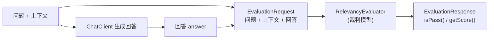

# 17 · 模型评估 Evaluation

> 本模块目标：学会用**一个模型当裁判**去给**另一个模型的回答**自动打分。用 `RelevancyEvaluator` 评估“回答是否切题（与问题+上下文相关）”。

## 一、要懂的核心概念

| 概念 | 大白话解释 |
|---|---|
| **模型评估 Evaluation** | 量化 AI 回答质量，而不是靠人肉一条条看。 |
| **LLM-as-a-judge** | 用大模型当“裁判”：把 [问题+上下文+待评回答] 交给它，让它按标准判定通过与否并给分。 |
| **相关性 Relevancy** | 回答是否切题、是否基于给定上下文。→ `RelevancyEvaluator` |
| **事实性 FactChecking** | 回答的事实有没有被上下文支持、有没有幻觉。→ `FactCheckingEvaluator` |
| **EvaluationRequest** | 一次评估的输入：用户问题 + 上下文文档列表 + 待评估回答文本。 |
| **EvaluationResponse** | 评估结果：`isPass()` 是否通过、`getScore()` 分数、`getFeedback()` 理由。 |

> 一句话：**评估 = 让裁判模型给回答打分**，是 RAG / Agent 上线前后做“质量回归”的关键手段。

## 二、评估流程图



## 三、关键代码

```java
// 构造评估器：内部用模型当裁判，所以传入 ChatClient.Builder
RelevancyEvaluator evaluator = new RelevancyEvaluator(chatClientBuilder);

// 组装输入：问题 + 上下文文档 + 待评估回答
EvaluationRequest request = new EvaluationRequest(question, List.of(contextDoc), answer);

// 打分
EvaluationResponse result = evaluator.evaluate(request);
result.isPass();    // 是否通过（切题）
result.getScore();  // 相关性分数
```

## 四、怎么运行

```bash
cd 17-evaluation
mvn spring-boot:run
```

会依次：① 生成一个切题回答并评估（预期 `isPass=true`）；② 对照评估一个故意跑题的回答（预期 `isPass=false`）。

> 注意：评估本身也要调用模型（裁判），所以本模块一次运行会产生**多次**模型调用。

## 五、预期输出（示例）

```
========== 模块17：模型评估(Evaluation) ==========

【第1步】先用 ChatClient 生成一个回答：
【我问】Spring AI Alibaba 的对话入口 API 是什么？
【AI 答】最常用的对话入口是 ChatClient，用 prompt().user().call().content() 链式调用……

【第2步】用 RelevancyEvaluator 评估“该回答是否与问题+上下文相关”：
  是否通过 isPass = true
  相关性分数 score = 1.0

【第3步】对照实验：故意给一个明显跑题的回答……
  是否通过 isPass = false  （预期为 false）
  相关性分数 score = 0.0

========== 演示结束：给 AI 回答自动打分 ==========
```

## 六、小结

- `RelevancyEvaluator` 判“切题”，`FactCheckingEvaluator` 判“有无幻觉”，都属 LLM-as-a-judge。
- 三件套：`EvaluationRequest`（输入）→ `evaluator.evaluate()` → `EvaluationResponse`（`isPass`/`score`）。
- 把它接进单元测试，就能对 RAG/Agent 做“质量回归”，防止改动后回答变差。
- 下一站：[18-prompt-engineering](../18-prompt-engineering) 学习提示工程四大模式，直接提升回答质量。
