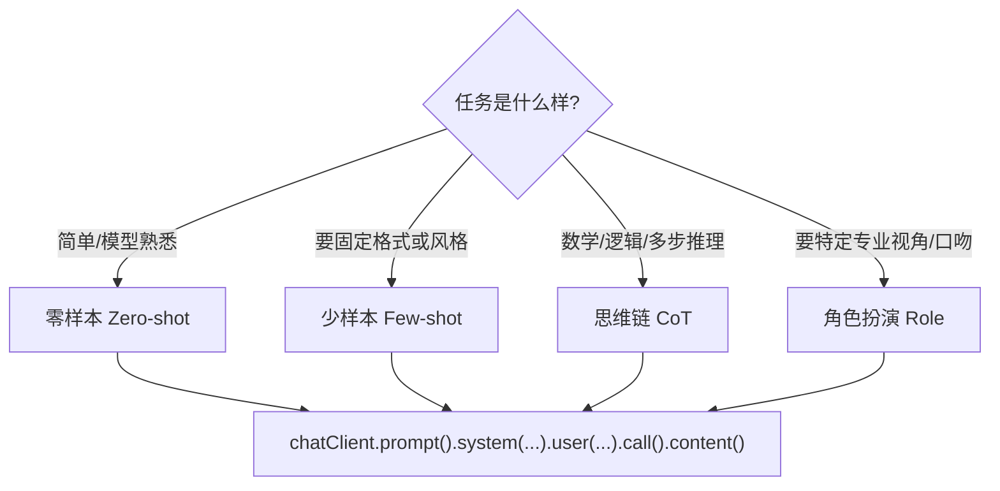

# 18 · 提示工程模式 Prompt Engineering

> 本模块目标：同一个模型，问法不同、效果天差地别。用**纯 ChatClient** 演示四种最常用的提示模式（零样本 / 少样本 / 思维链 / 角色扮演），并打印对比效果。

## 一、四大模式一览

| 模式 | 大白话 | 适用场景 |
|---|---|---|
| **零样本 Zero-shot** | 直接下指令，不给例子。 | 任务简单、模型本来就会。最省事省 token。 |
| **少样本 Few-shot** | 提示里给几个“输入→输出”示例，照葫芦画瓢。 | 需要固定输出格式/风格，用语言难描述时。 |
| **思维链 CoT** | 让模型“请一步步思考”再给结论。 | 数学 / 逻辑 / 多步推理，显著提升正确率。 |
| **角色扮演 Role** | 用 `system` 设定专家身份/口吻。 | 想要特定专业视角、语气、受众时。 |

> 本质：这些模式**不是新 API**，只是往 `system()` / `user()` 里塞不同文本。
> `system(...)` 放身份/规则/示例（权重高、全局生效）；`user(...)` 放本次具体问题。

## 二、模式选择流程图



## 三、关键代码（四种模式，同一套 API）

```java
// 零样本：直接问
ask(null, "判断情感（正面/负面）：这家店服务太贴心了。");

// 少样本：system 里给示例
ask("""
    你是情感分类器，只输出：正面/负面/中性。
    示例：这手机不耐用。→负面    物流很快。→正面
    """, "客服半天不回消息。→");

// 思维链：要求一步步思考
ask("解题时先分步计算，最后一行用“答案：”给结果。", 数学题);

// 角色扮演：system 设定身份
ask("你是资深软件架构师，语言精炼专业。", "我该怎么开始学习编程？");
```

## 四、怎么运行

```bash
cd 18-prompt-engineering
mvn spring-boot:run
```

会依次演示四种模式并打印对比。其中思维链一步会同时打印“不用 CoT”和“用 CoT”的结果供你对照。

## 五、预期输出（示例）

```
========== 模块18：提示工程四大模式 ==========

---------- ① 零样本 Zero-shot（直接下指令） ----------
【AI 答】正面

---------- ② 少样本 Few-shot（给几个示例） ----------
【AI 答】负面

---------- ③ 思维链 CoT（请一步步思考） ----------
【不用CoT · 只要答案】30
【用CoT · 分步推理】
  1) 3盒×12支=36支  2) 送出8支：36-8=28支  3) 又买2盒：28+24=52支
  答案：52

---------- ④ 角色扮演 Role（设定专家身份） ----------
【角色A·少儿编程老师】就像搭积木一样……
【角色B·资深架构师】先定方向(前端/后端)，再……

========== 演示结束：把话说好，模型才答得好 ==========
```

## 六、小结

- 四种模式全靠 `system()/user()` 的文字差异，API 一模一样。
- 选择口诀：简单→零样本；要格式→少样本；要推理→思维链；要视角→角色扮演。
- 把提示写好，常比换更贵的模型更划算。
- 下一站：[19-graph-basic](../19-graph-basic) 进入阿里旗舰能力 **Graph** —— 用 `StateGraph` 编排多步骤 AI 工作流。
