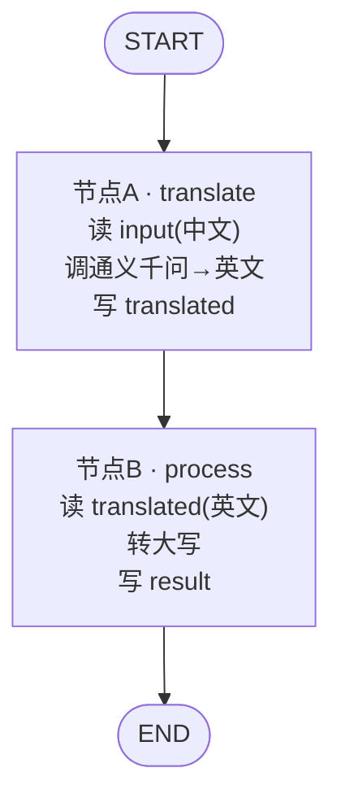

# 19 · Graph 基础（阿里核心能力）

> 本模块目标：认识 Spring AI Alibaba 最有特色的 **Graph（图）编排**，用 `StateGraph` 搭一个最小工作流：`START →(翻译)→(加工)→ END`，并看懂状态如何在节点间流转。

## 一、要懂的核心概念

| 概念 | 大白话解释 | 对应 LangGraph |
|---|---|---|
| **StateGraph** | 工作流的“蓝图”：声明有哪些节点、怎么连线。本身不能跑。 | `StateGraph` |
| **Node（节点）** | 一个处理步骤。本质是 `state -> Map`：读全局状态，返回要更新的键值对。 | `node` |
| **Edge（边）** | 节点之间的连线，决定执行顺序。`START` 是入口，`END` 是出口。 | `edge` |
| **OverAllState** | 在所有节点间流动的“共享状态字典”。 | `State` |
| **KeyStrategy** | 状态里每个 key 的**合并策略**：`ReplaceStrategy`=覆盖，`AppendStrategy`=追加。 | reducer |
| **CompiledGraph** | 蓝图 `compile()` 后得到的“可执行图”，用 `invoke(初始状态)` 运行。 | `compile()` |

> 一句话关系：**Graph = 把“多步骤 AI 流程”画成一张图**，每个节点做一件事、共享一份状态，步骤自动流转。
> 它借鉴了 Python 生态的 LangGraph，但这里是 Java + Spring，节点里可直接调用通义千问。

## 二、本模块的流程图



## 三、关键代码

```java
// 1) 注册状态键 + 合并策略（三个 key 都用“覆盖”）
KeyStrategyFactory factory = () -> {
    HashMap<String, KeyStrategy> m = new HashMap<>();
    m.put("input", new ReplaceStrategy());
    m.put("translated", new ReplaceStrategy());
    m.put("result", new ReplaceStrategy());
    return m;
};

// 2) 定义节点：state -> Map（读状态、返回要更新的键值对）
NodeAction translate = state -> {
    String input = state.value("input", String.class).orElse("你好");
    String en = chatClient.prompt().user(input).call().content();
    return Map.of("translated", en);   // 写回全局状态
};

// 3) 建图 → 连线 → 编译 → 运行
StateGraph graph = new StateGraph(factory)
        .addNode("translate", node_async(translate))   // 注意：node_async 是下划线
        .addNode("process", node_async(process))
        .addEdge(START, "translate")
        .addEdge("translate", "process")
        .addEdge("process", END);
Optional<OverAllState> out = graph.compile().invoke(Map.of("input", "人工智能正在改变世界。"));
```

> ⚠️ 易错点：把普通节点包装成异步节点的静态方法名是 **`node_async`（带下划线）**，
> 静态导入：`import static com.alibaba.cloud.ai.graph.action.AsyncNodeAction.node_async;`

## 四、怎么运行

1. 配好百炼 Key（见根目录 `config/spring-ai-alibaba-common.yml` 或环境变量 `AI_DASHSCOPE_API_KEY`）。
2. 在**本模块目录**执行：

```bash
cd 19-graph-basic
mvn spring-boot:run
```

## 五、预期输出（示例）

```
========== 模块19：Graph 入门 —— 最小工作流(翻译→加工) ==========

【输入】人工智能正在改变世界。

  [节点A·translate] 收到中文输入 = 人工智能正在改变世界。
  [节点A·translate] 翻译成英文 = Artificial intelligence is changing the world.
  [节点B·process ] 转大写后 = ARTIFICIAL INTELLIGENCE IS CHANGING THE WORLD.

【最终全局状态 OverAllState】
  input      = 人工智能正在改变世界。
  translated = Artificial intelligence is changing the world.
  result     = ARTIFICIAL INTELLIGENCE IS CHANGING THE WORLD.

========== 演示结束：这就是一张最小的 Graph 工作流！ ==========
```

## 六、小结

- Graph 把“多步骤 AI 流程”抽象成 **节点 + 边 + 共享状态**，步骤自动流转、易于复用和调试。
- 建图四步：**注册 KeyStrategy → 定义 NodeAction → addNode/addEdge 连线 → compile().invoke()**。
- 记牢下划线的 `node_async` / `edge_async`。
- 下一站：[20-graph-parallel](../20-graph-parallel) 学习**并行节点**——让多个步骤同时跑、再汇聚，省时间。
