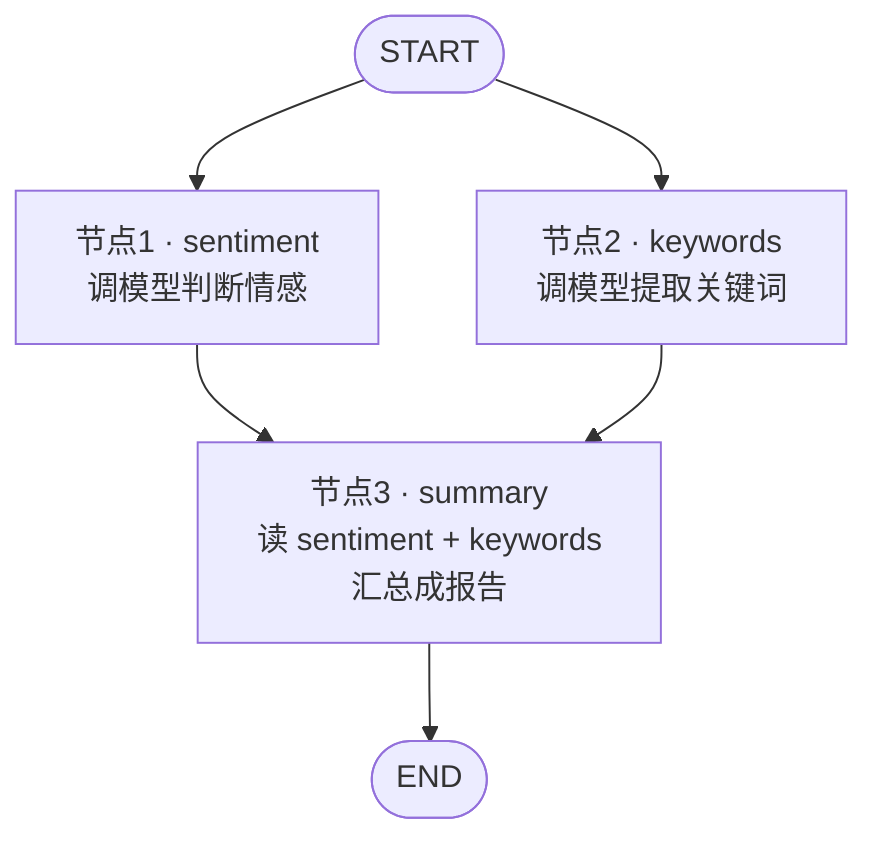

# 20 · Graph 并行节点

> 本模块目标：在模块 19 的串行流水线之上，学习 Graph 的**并行（分叉-汇聚）**：让【情感分析】和【关键词提取】同时跑，再汇聚到【汇总】节点，体会“并行省时间”。

## 一、要懂的核心概念

| 概念 | 大白话解释 |
|---|---|
| **分叉 (Fan-out)** | 一个节点（或 START）连出**多条边**到不同节点，这些节点会**并发执行**。 |
| **汇聚 (Fan-in)** | 多个节点都连到**同一个下游节点**，下游会**等所有上游都完成**后再执行。 |
| **不同 key + ReplaceStrategy** | 并行节点各写各的 key（`sentiment`/`keywords`），互不覆盖，汇聚节点分别读取。 |
| **同一 key + AppendStrategy** | 若多个并行节点要写**同一个 key**，用追加策略把结果收集成列表。 |

> 一句话：**互不依赖的步骤就并行**，总耗时≈最慢的那个分支，而不是各分支相加。

## 二、本模块的流程图



## 三、关键代码

```java
StateGraph graph = new StateGraph(factory)
        .addNode("sentiment", node_async(sentimentNode))
        .addNode("keywords",  node_async(keywordsNode))
        .addNode("summary",   node_async(summaryNode))
        // 分叉：START 同时连到两个节点 = 并行
        .addEdge(START, "sentiment")
        .addEdge(START, "keywords")
        // 汇聚：两个节点都连到 summary（等两路到齐再执行）
        .addEdge("sentiment", "summary")
        .addEdge("keywords",  "summary")
        .addEdge("summary", END);
```

## 四、怎么运行

```bash
cd 20-graph-parallel
mvn spring-boot:run
```

## 五、预期输出（示例）

```
========== 模块20：Graph 并行节点(分叉→汇聚) ==========

【输入评论】这家餐厅的菜品味道很棒，服务也热情，就是等位时间有点长。

  [并行·sentiment] 开始分析情感...
  [并行·keywords ] 开始提取关键词...
  [并行·keywords ] 完成 = 菜品、味道、服务、等位时间
  [并行·sentiment] 完成 = 正面：整体评价积极，仅对等位时间略有不满。

  [汇聚·summary  ] 两路结果已到齐，生成综合报告

【综合报告】
    - 情感倾向：正面：整体评价积极，仅对等位时间略有不满。
    - 核心关键词：菜品、味道、服务、等位时间

  两个分支并行执行，总耗时约 1600 ms（若改成串行，两次模型调用会相加）

========== 演示结束：并行=省时间！ ==========
```

## 六、小结

- **分叉**=一个节点连出多条边；**汇聚**=多条边汇到一个节点（等齐再走）。
- 并行节点写**不同 key** 用 `ReplaceStrategy`；写**同一 key** 用 `AppendStrategy` 收集成列表。
- 下一站：[21-graph-human-in-the-loop](../21-graph-human-in-the-loop) 学习**人类介入**——AI 出方案后暂停等人审批，通过才继续。
