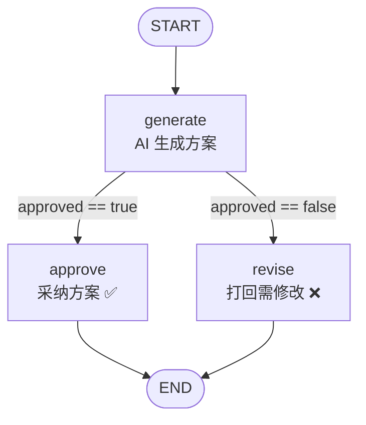

# 21 · Graph 人类介入 (Human-in-the-Loop)

> 本模块目标：让 AI 智能体学会“听人指挥”——**AI 出方案 → 人来审批 → 通过才继续，否决就打回**。用 Graph 的**条件边**表达这个决策分支。

## 一、要懂的核心概念

| 概念 | 大白话解释 |
|---|---|
| **人类介入 (HITL)** | 高风险动作（发邮件/下单/改库）不让 AI 全自动，插入一步“人工审批”。 |
| **条件边 (ConditionalEdge)** | 一条会“看情况选路”的边：读状态，返回一个路由名，跳到对应节点。 |
| **`addConditionalEdges`** | 注册条件边：`(源节点, edge_async(判断逻辑), 路由名→目标节点映射表)`。 |
| **`edge_async`** | 把 `state -> String`（返回路由名）包装成异步条件动作。**下划线**命名。 |

> 本模块为保证编译简单，用“预置的 `approved` 布尔标志 + 条件边”模拟审批结果；
> 真实生产用**中断-恢复**（见第六节），核心概念是一样的。

## 二、本模块的流程图



## 三、关键代码

```java
StateGraph graph = new StateGraph(factory)
        .addNode("generate", node_async(generateNode))
        .addNode("approve",  node_async(approveNode))
        .addNode("revise",   node_async(reviseNode))
        .addEdge(START, "generate")
        // ★ 条件边：读 approved，映射到不同节点
        .addConditionalEdges("generate",
                edge_async(state -> state.value("approved", Boolean.class).orElse(false) ? "pass" : "reject"),
                Map.of("pass", "approve", "reject", "revise"))
        .addEdge("approve", END)
        .addEdge("revise", END);

// 先以 approved=false 跑（被打回），再以 approved=true 跑（通过）
compiledGraph.invoke(Map.of("task", task, "approved", false));
compiledGraph.invoke(Map.of("task", task, "approved", true));
```

## 四、怎么运行

```bash
cd 21-graph-human-in-the-loop
mvn spring-boot:run
```

## 五、预期输出（示例）

```
——— 第 1 次运行：人工审批结果 = 打回(approved=false) ———
  [generate] AI 方案已生成：...
  [revise  ] ❌ 被人工打回：方案需按反馈修改后重新提交。
  [结果] 未通过审批，方案被打回，需要修改。

——— 第 2 次运行：人工审批结果 = 通过(approved=true) ———
  [generate] AI 方案已生成：...
  [approve ] ✅ 审批通过：方案被正式采纳，进入执行阶段。
  [结果] 已通过审批，方案被采纳执行。
```

## 六、进阶：真实生产用“中断 + 恢复”

本模块用预置标志模拟审批。真实场景需要**真正暂停**图、把状态存起来、等前端人工点击后再恢复：

```java
import com.alibaba.cloud.ai.graph.CompileConfig;
import com.alibaba.cloud.ai.graph.checkpoint.savers.MemorySaver;
import com.alibaba.cloud.ai.graph.RunnableConfig;

// 编译时声明：在进入 approve 节点【之前】中断，交还控制权给人
CompileConfig config = CompileConfig.builder()
        .saverConfig(...)                 // 配置检查点存储（如 MemorySaver），用于保存中断时的状态
        .interruptBefore("approve")       // 在该节点前中断
        .build();
CompiledGraph compiled = graph.compile(config);

RunnableConfig thread = RunnableConfig.builder().threadId("会话1").build();
compiled.invoke(Map.of("task", task), thread);   // 跑到 approve 前会停下（中断）

// ……前端展示方案，人工点击“通过”后：把 approved 写进状态并恢复执行……
compiled.updateState(thread, Map.of("approved", true));
compiled.invoke(null, thread);                    // 从中断点继续跑完
```

> 不同小版本 API 名称可能略有差异（如 `saverConfig` / `checkpointSaver`），以你引入版本的源码为准；概念不变：**interruptBefore 中断 → 存状态 → 人工决策 → resume 恢复**。

## 七、小结

- 人类介入 = 在关键节点前插一步“人工审批”，防止 AI 越权。
- 条件边 `addConditionalEdges` + `edge_async` 能根据状态**动态选择下一步**。
- 生产用 `interruptBefore` 真正中断、`resume` 恢复；本模块用预置标志把概念讲清。
- 下一站：[22-agent-react](../22-agent-react) 学习 **ReAct 智能体**——让 AI 自己决定“先推理、再调工具、再回答”。
