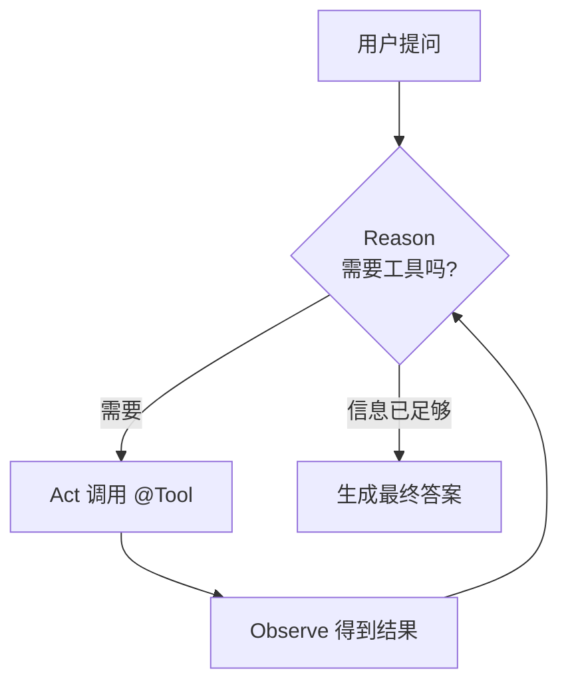

# 22 · ReAct 智能体 (Reasoning + Acting)

> 本模块目标：理解最经典的智能体范式 **ReAct = 推理(Reason) + 行动(Act)**，并用 `ChatClient + @Tool` 做一个“会自己查天气、算数再回答”的智能体。

## 一、要懂的核心概念

| 概念 | 大白话解释 |
|---|---|
| **ReAct** | AI 不再张口就答，而是“**先想 → 缺信息就调工具 → 看结果 → 再想 → 再答**”的循环。 |
| **Reason（推理）** | 模型判断“我需要什么信息 / 该用哪个工具”。 |
| **Act（行动）** | 模型自动调用一个工具（计算器 / 天气 / 搜索）。 |
| **Observe（观察）** | 拿到工具返回值，喂回模型继续推理。 |
| **`@Tool`** | 给普通 Java 方法加这个注解，就成了模型可调用的工具。 |
| **工具自动多轮调用** | Spring AI 自动帮你跑完“模型↔工具”的多轮循环，一次 `call()` 搞定。 |

> 一句话：**给 ChatClient 挂上工具，它就从“聊天机器人”升级成“会办事的智能体”。**

## 二、ReAct 循环流程图



## 三、关键代码

```java
// 1) 工具箱：普通方法 + @Tool 注解
public class ReactTools {
    @Tool(description = "计算两个整数相加的结果")
    public int add(@ToolParam(description="第一个加数") int a,
                   @ToolParam(description="第二个加数") int b) { return a + b; }

    @Tool(description = "查询指定城市今天的天气")
    public String queryWeather(@ToolParam(description="城市名") String city) { ... }
}

// 2) 把工具挂到 ChatClient，一次 call() 自动完成 ReAct 多轮循环
ChatClient chatClient = builder.defaultTools(new ReactTools()).build();
String answer = chatClient.prompt()
        .user("杭州今天天气怎么样？再帮我算 18 + 24")
        .call().content();
```

## 四、进阶：用 Spring AI Alibaba 的 `ReactAgent` 高级封装

框架自带 `com.alibaba.cloud.ai.graph.agent.ReactAgent`，底层用 Graph 编排出推理-行动循环，一行 builder 造出智能体（以下片段展示思路，具体方法名以你引入的版本源码为准）：

```java
import com.alibaba.cloud.ai.graph.agent.ReactAgent;

ReactAgent agent = ReactAgent.builder()
        .name("assistant")
        .chatClient(chatClient)          // 用哪个大模型
        .tools(List.of(...))             // 可用工具列表（ToolCallback）
        .maxIterations(10)               // 最多推理-行动几轮，防止死循环
        .build();

// 编译成 Graph 后调用（ReactAgent 本质就是一张预置好的 ReAct 图）
var compiled = agent.getAndCompileGraph();
var result = compiled.invoke(Map.of("messages", "杭州天气如何？"));
```

> 为什么示例代码不直接用它？因为不同小版本 `ReactAgent` 的 builder 方法名/入参略有差异。
> 用 `ChatClient + @Tool` 演示能保证**一定编译运行通过**，而思想（推理-行动循环）完全一致。

## 五、怎么运行

```bash
cd 22-agent-react
mvn spring-boot:run
```

## 六、预期输出（示例）

```
【用户提问】杭州今天天气怎么样？另外帮我算一下 18 加 24 等于多少。

——— 智能体开始工作 ———
    >> [工具被调用] queryWeather("杭州")
    >> [工具被调用] add(18, 24) = 42

【智能体最终回答】
杭州今天晴，气温 26℃，微风，空气质量优。另外，18 加 24 等于 42。
```

## 七、小结

- ReAct = **推理 + 行动**的循环：AI 会自己决定“先查/算，再回答”。
- 落地最稳的方式：`ChatClient + @Tool`，Spring AI 自动跑完多轮工具调用。
- 高级封装 `ReactAgent` 用 Graph 把这套循环打包好，开箱即用。
- 下一站：[23-tool-calling-community](../23-tool-calling-community) 学习**社区工具集**——一行接入现成的百度搜索等工具。
