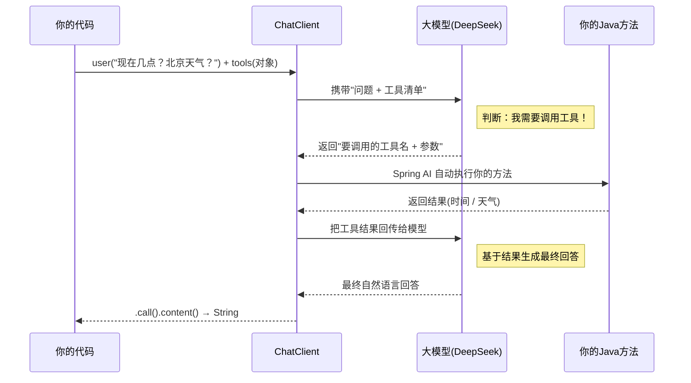

# 08 · Tool Calling（工具调用 / 函数调用）

> 本模块目标：让大模型在需要时**自动调用你写的 Java 方法**，获取实时/外部数据后再回答。这是构建智能体(Agent)的基础。

## 一、为什么需要工具调用

大模型是"训练时的快照"，它**不知道**：现在几点、今天天气、你数据库里的订单……
**工具调用**给模型装上"手脚"：当问题需要这些信息时，模型会主动请求调用你提供的方法，拿到结果再组织答案。

| 概念 | 说明 |
|---|---|
| `@Tool` | 标注在方法上，`description` 告诉模型"这个工具能干什么"（模型据此决定何时调用） |
| `@ToolParam` | 标注在参数上，`description` 告诉模型"这个参数是什么"（模型据此抽取参数值） |
| `.tools(对象)` | 把含 `@Tool` 方法的对象注册给本次调用 |

> 包路径（1.1.7，经 `javap` 查证）：
> `org.springframework.ai.tool.annotation.Tool`、`org.springframework.ai.tool.annotation.ToolParam`。
> `@Tool` 可用属性：`name` / `description` / `returnDirect` / `resultConverter`；
> `@ToolParam` 可用属性：`description` / `required`。

## 二、工具调用的完整回合（流程图）



> 关键：整个"判断 → 调用 → 回传 → 再回答"由 **Spring AI 自动编排**，可能来回多轮（本例同时查时间和天气）。你只需写好方法并 `.tools(...)` 注册。

## 三、关键代码

定义工具（普通 Java 类 + 注解）：

```java
public class DateTimeTools {
    @Tool(description = "获取当前的日期和时间")
    String getCurrentDateTime() {
        return java.time.LocalDateTime.now().toString();
    }

    @Tool(description = "获取指定城市的当前天气情况")
    String getWeather(@ToolParam(description = "要查询天气的城市名称，例如：北京") String city) {
        return city + "今天晴，25 摄氏度";
    }
}
```

注册并调用：

```java
String answer = chatClient.prompt()
        .user("现在几点了？北京天气怎么样？")
        .tools(new DateTimeTools())   // 注册工具，模型按需自动调用
        .call()
        .content();
```

## 四、`@Tool` / `@ToolParam` 全部属性详解

> 包路径（Spring AI 1.1.7，`javap` 逐个查证）：`org.springframework.ai.tool.annotation.Tool`、`org.springframework.ai.tool.annotation.ToolParam`。

### `@Tool`（标注在方法上）

| 属性 | 类型 | 默认 | 作用 |
|---|---|---|---|
| `name` | String | 方法名 | 工具名（模型看到的标识）。不填就用方法名，一般不用特意写 |
| `description` | String | `""` | **最关键**：工具用途说明，模型据此判断"何时该调这个工具"。写得越清楚调用越准 |
| `returnDirect` | boolean | `false` | `true` = 工具结果**直接返回给用户**，不再回喂模型二次润色（省一轮 LLM 调用） |
| `resultConverter` | `Class<? extends ToolCallResultConverter>` | `DefaultToolCallResultConverter` | 自定义"方法返回值 → 给模型的文本"的转换器（默认把返回值序列化成 JSON） |

```java
// name + description：给工具起名、讲清用途
@Tool(name = "queryOrder", description = "根据订单号查询订单的当前状态和物流信息")
String query(@ToolParam(description = "订单号，如 NO20260719") String orderNo) { ... }

// returnDirect = true：结果直接给用户，不再让模型改写
// 适合"结果本身就是最终答复"的场景，如生成一张回执、一段固定格式文本
@Tool(description = "提交退款申请并返回受理回执", returnDirect = true)
String refund(@ToolParam(description = "订单号") String orderNo) {
    return "已受理退款，受理单号 RF" + orderNo + "，1-3 个工作日到账";
}
```

### `@ToolParam`（标注在参数上）

| 属性 | 类型 | 默认 | 作用 |
|---|---|---|---|
| `description` | String | `""` | 参数含义，模型据此从用户输入里**抽取该参数值** |
| `required` | boolean | `true` | 参数是否必填。`false` = 可选，模型可以不提供 |

```java
@Tool(description = "查询某城市未来几天的天气")
String forecast(
        @ToolParam(description = "城市名称，如 北京") String city,
        // required = false：用户没说天数就用默认值，模型可不传
        @ToolParam(description = "预报天数，1-7，默认 3", required = false) Integer days) {
    int d = (days == null) ? 3 : days;
    return city + " 未来 " + d + " 天：晴转多云";
}
```

> 小贴士：参数是否必填也可用 `@ToolParam(required=false)` 或直接用 `@Nullable`；`description` 建议每个参数都写，否则模型抽参容易出错。

## 五、Spring AI 注解全景（完整清单）

> **先建立认知**：Spring AI **刻意"重 fluent API、轻注解"**——它**自有的注解只有 `@Tool` 和 `@ToolParam` 两个**（都在本模块）。ChatClient、Advisor、结构化输出、RAG、记忆等能力**全走 builder 链式 API，没有注解**（这点和 LangChain4j 的 `@AiService`/`@SystemMessage`/`@UserMessage` 满天飞正相反）。真正成体系的注解在**构建 MCP 服务端**时才会用到。

### A. 核心工具注解 —— `org.springframework.ai.tool.annotation`（spring-ai-model 自带）

| 注解 | 用在 | 作用 | Demo |
|---|---|---|---|
| `@Tool` | 方法 | 把 Java 方法暴露为大模型可调用的工具 | `@Tool(description="查天气") String getWeather(...)` |
| `@ToolParam` | 参数 | 描述工具参数，供模型抽参 | `@ToolParam(description="城市") String city` |

### B. MCP 注解家族 —— `org.springaicommunity.mcp.annotation`（由 `spring-ai-mcp-annotations` 引入）

> ⚠️ 注意：这些**不在 `org.springframework.ai` 包下**，而是 Spring AI 官方 MCP starter 依赖的**社区配套库**（`org.springaicommunity:mcp-annotations`）。当你用 Spring AI 写 **MCP 服务端**（把能力按 MCP 协议暴露给任意 AI 客户端）时用它们声明式注册。对标模块 [14-mcp](../14-mcp)。

**服务端·声明式暴露能力：**

| 注解 | 用在 | 作用 | 关键属性 |
|---|---|---|---|
| `@McpTool` | 方法 | 把方法暴露为 **MCP 工具**（MCP 版的 `@Tool`） | `name` / `description` / `title` / `generateOutputSchema` |
| `@McpToolParam` | 参数 | 描述 MCP 工具参数 | `description` / `required` |
| `@McpResource` | 方法 | 暴露一个**资源**（可读数据/文件），有 URI | `uri` / `name` / `description` / `mimeType` |
| `@McpPrompt` | 方法 | 暴露一个**可复用提示模板** | `name` / `title` / `description` |
| `@McpArg` | 参数 | 描述 `@McpPrompt` 的参数 | `name` / `description` / `required` |
| `@McpComplete` | 方法 | 为 prompt/资源参数提供**自动补全** | `prompt` / `uri` |

```java
// MCP 服务端：用注解把方法暴露成 MCP 工具（供 Claude Desktop / 其它 AI 客户端调用）
@Service
class WeatherMcpTools {
    @McpTool(name = "getWeather", description = "查询城市天气")
    String getWeather(@McpToolParam(description = "城市名", required = true) String city) {
        return city + " 晴 26℃";
    }

    @McpResource(uri = "config://app/version", description = "应用版本号")
    String version() { return "v1.0.0"; }

    @McpPrompt(name = "code_review", description = "生成代码审查提示")
    String reviewPrompt(@McpArg(name = "lang", description = "语言") String lang) {
        return "请审查这段 " + lang + " 代码……";
    }
}
```

**高级·上下文与通知（了解即可）：**

| 注解 | 作用 |
|---|---|
| `@McpProgress` / `@McpProgressToken` | 长任务的**进度通知** / 接收进度 token |
| `@McpLogging` | 接收/发送**日志通知** |
| `@McpSampling` | 服务端**反向请求客户端的 LLM 采样**（让 client 侧模型帮忙生成） |
| `@McpElicitation` | 服务端**向客户端请求补充输入**（交互式追问） |
| `@McpMeta` | 注入 `_meta` 元数据 |
| `@McpToolListChanged`<br>`@McpResourceListChanged`<br>`@McpPromptListChanged` | **客户端**侧：监听服务端"工具/资源/提示列表变更"通知的处理器 |

### C. 结构化输出：借用 Jackson 注解（不是 Spring AI 自己的）

> Spring AI 的结构化输出（`.entity(XxxClass)`）**没有专属注解**，靠 Jackson 注解给模型描述字段语义（会被拼进 JSON Schema），见模块 [04-structured-output](../04-structured-output)。

| 注解 | 作用 | Demo |
|---|---|---|
| `@JsonProperty` | 指定字段名/必填 | `@JsonProperty(required=true) String title;` |
| `@JsonPropertyDescription` | **字段语义**（进 Schema 给模型看，模型据此填值） | `@JsonPropertyDescription("电影上映年份") int year;` |
| `@JsonClassDescription` | 类级整体描述 | `@JsonClassDescription("一部电影的信息")` |

> 📌 一句话记：**Spring AI 自有注解 = `@Tool` + `@ToolParam`（就这俩）**；写 MCP 服务端才用 `@Mcp*` 家族；结构化输出借 Jackson 的 `@Json*`。其余一切走 builder，不用注解。

## 六、运行

```bash
cd 08-tool-calling
mvn spring-boot:run
```

依赖 DeepSeek 的 Key（已在 `../config/spring-ai-common.yml` 配置）。运行后控制台带 `🔧` 的行表示对应工具方法确实被模型自动调用了。

## 七、小结

- 用 `@Tool` / `@ToolParam` 描述方法和参数，模型靠 `description` 决定何时调用、如何取参。
- `.tools(对象)` 注册工具，"判断→调用→回传→回答"全自动。
- `description` 写得越清楚，模型调用越准确。
- 下一站：[09-structured-output](../09-structured-output)（按项目实际模块顺序）继续学习结构化输出等进阶能力。
